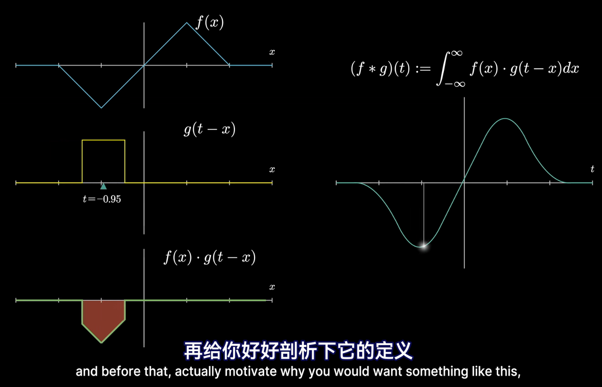

# 1 傅里叶变换、拉普拉斯变换和z变换

## 1.1 什么是傅里叶变换

关于傅里叶变换的更直观形象的讲述，请参见[【官方双语】形象展示傅里叶变换 - 3Blue1Brown](https://www.bilibili.com/video/BV1pW411J7s8)。

傅里叶变换表明，**任何周期函数都可以看作是一堆正弦/余弦函数的叠加**。

$$x(t)=\frac{a_{0}}{2}+\sum_{n=1}^{\infty}{[a_{n}cos(n\Omega_{0}t)+b_{n}sin(n\Omega_{0}t)]}$$

其中：

$$a_{n}=\frac{2}{T_{0}}\int_{-\frac{T_0}{2}}^{\frac{T_0}{2}}{x(t)cos(n\Omega_{0}t)dt}$$

$$b_{n}=\frac{2}{T_{0}}\int_{-\frac{T_0}{2}}^{\frac{T_0}{2}}{x(t)sin(n\Omega_{0}t)dt}$$

我们知道复数的表示法 $e^{j\omega}=cos(\omega)+jsin(\omega)$ ，因此合并 $X(t)$ 中各项可得

$$x(t)=\sum_{n=-\infty}^{n=\infty}{c_{n}e^{jn\Omega_{0}t}}$$

其中 $c_{n}=\frac{a_{n}-jb_{n}}{2}$ ，其共轭 $c_{n}^{*}=\frac{a{n}+jb_{n}}{2}$ 。

这是傅里叶变换关于时域的表达式。借助傅里叶变换，可以实现时域与频域的相互转化。傅里叶变换关于频域的表达式为

$$X(n\Omega_{0})=c_{n}=\frac{1}{T_{0}}\int_{-\frac{T_{0}}{2}}^{\frac{T_0}{2}}{x(t)e^{jn\Omega_{0}t}dt}$$

可以看出，其并不是连续的，是离散的，只在 $n\Omega_{0}$ 处才存在取值。由此我们可以得出结论：**连续时间周期信号的频谱为离散谱线**。

每个复数都可以用二维复平面上的点 $(x,y)$ 唯一表示，以复平面原点为起点，可以构造一条向量 $\vec{i}=(x,y)$ ，该向量具有幅度 $||\vec{i}||$ 和相位 ${θ=atan2(y,x)}$ 。在傅里叶变换中，将 $|X(n\Omega_{0})|$ 称为幅度，将 ${θ_{n}}$ 称为相位谱。

对于非周期函数呢？

**我们可以将非周期函数看作是一个周期为无穷大的周期函数**，这样就可以应用傅里叶变换将非周期函数由时域变换至频域。由于 $T \to \infty$ 时， $\frac{1}{T} \to \frac{\Omega_{0}}{2\pi}$ ，因此，傅里叶变换在时域的表达式（傅里叶反变换）

$$x(t)=\frac{1}{2\pi}\int_{-\infty}^{\infty}{X(j\Omega)e^{j\Omega t}dt}$$

其在频域的表达式（傅里叶变换）

$$X(j\Omega)=\int_{-\infty}^{\infty}{x(t)e^{-j\Omega t}dt}$$

其实部、虚部、幅度和相位谱分别为：

$$Re[X(j\Omega)]=\int_{-\infty}^{\infty}{x(t)cos(\Omega t)dt}$$

$$Im[X(j\Omega)]=\int_{-\infty}^{\infty}{x(t)sin(\Omega t)dt}$$

$$|X(j\Omega)|=\sqrt{Re^{2}[X(j\Omega)]+Im^{2}[X(j\Omega)]}$$

$$θ(\Omega)=atan2(Im[X(j\Omega)],Re[X(j\Omega)])$$

我们可以得出结论：**连续时间非周期信号的频谱为连续谱线**，其形状与周期脉冲信号的离散频谱包络线相似。

之后我们会将时域表达式和与之对应的频率表达式及它们之间的傅里叶变换（包含反变换）记为

$$x(t) \iff X(j\Omega)$$

其中从左向右表示傅里叶变换，从右向左表示傅里叶逆变换。傅里叶变换也常被记作 $X(j\Omega)=\mathcal{F}[x(t)]$ 。

## 1.2 连续时间傅里叶变换的性质

连续时间傅里叶变换具有如下性质：

（1）线性

$$a_{1}x(t)+a_{2}y(t) \iff a_{1}X(j\Omega)+a_{2}y(j\Omega)$$

（2）对偶性

$$x(t) \iff X(j\Omega) ↔ X(j\Omega) \iff 2\pi x(-t)$$

（3）时域变化导致的频域变化

$$x(kt) \iff \frac{1}{|k|}X(j\frac{\Omega}{k})$$

（4）频域变化导致的时域变化

$$\frac{1}{|k|}x(\frac{t}{k}) \iff X(kj\Omega)$$

（5）时间移位

$$x(t-t_{0}) \iff X(j\Omega)e^{-j\Omega t_{0}}$$

（6）频率移位

$$x(t)e^{j\Omega_{0}t} \iff X[j(\Omega-\Omega_{0})]$$

（7）奇偶性

信号为偶函数，频谱为偶函数；信号为奇函数，频谱为奇函数。

（8）微分性质

$$\frac{dx(t)}{dt} \iff j\Omega X(j\Omega),\frac{d^{n}x(t)}{dt^{n}} \iff (j\Omega)^{n}X(j\Omega)$$

$$-jtx(t) \iff \frac{dX(j\Omega)}{d\Omega},(-jt)^nx(t) \iff \frac{d^{n}X(j\Omega)}{d\Omega^{n}}$$

（9）积分性质

$$\int_{-\infty}^{t}{x(\tau)d\tau} \iff \pi X(0)\delta(\Omega)+\frac{1}{j\Omega}X(j\Omega)$$

$$\pi x(0)\delta(t)-\frac{1}{jt}x(t) \iff \int_{-\infty}^{\Omega}{X(j\omega)d\omega}$$

## 1.3 卷积与傅里叶变换

我们可以将一段序列 $\{(u,v)\}$ 用函数表示为 $v=f(u)$ ，此时若想知道序列中某个元素 $(u_{0},v_{0})$ 及其相邻元素之间的综合信息（相关关系等），就会将它和与它相邻的元素进行相乘后求和的操作。我们将这个操作叫做**卷积**。卷积的更直观形象的讲述可以参见[【官方双语】那么……什么是卷积？ - 3Blue1Brown](https://www.bilibili.com/video/BV1Vd4y1e7pj)。

连续序列的卷积（卷积核 $h(t)$ 也连续）用数学公式定义如下：

$$y(t)=\int_{-\infty}^{+\infty}{x(\tau)h(t-\tau)d\tau}=(x*h)(t)$$

卷积运算满足交换律：

$$(x*h)(t)=(h*x)(t)$$

将卷积与傅里叶变换结合起来，我们可以发现：

（1）时域上的卷积操作可转化为频域上的相乘操作

$$(x*h)(t) \iff X(j\Omega)H(j\Omega)$$

（2）频域上的卷积操作可转化为时域上的相乘操作

$$2\pi h(t)x(t) \iff (H*X)(j\Omega)$$

## 1.4 拉普拉斯变换

傅里叶变换中的参变量仅为纯虚数 $j\Omega$ ，将参变量扩展至整个复数域 $\{s\}$ ，可以得到拉普拉斯变换

$$X(s)=\int_{0}^{+\infty}x(t)e^{-st}dt$$

简记为 $X(s)=\mathcal{L}[x(t)]$ 。

拉普拉斯变换具有的性质为：

（1）线性

$$\mathcal{L}[a_{1}x(t)+a_{2}y(t)]=a_{1}\mathcal{L}[x(t)]+a_{2}\mathcal{L}[y(t)i]$$

（2）微分性质

$$\mathcal{L}[x'(t)]=sX(s)-x(0),\mathcal{L}[x^{(n)}(t)]=s^{n}X(s)-s^{n-1}x(0)-...-x^{(n-1)}(0)$$

$$(\mathcal{L}[x(t)])'=-\mathcal{L}[tx(t)],(\mathcal{L}[x(t)])^{(n)}=(-1)^{n}\mathcal{L}[t^{n}x(t)]$$

（3）积分性质

$$L[\int_{0}^{t}{x(t)dt}]=\frac{1}{s}X(s),L[\int_{0}^{t}{dt\int_{0}^{t}{dt...\int_{0}^{t}{x(t)dt}}}]=\frac{1}{s^{n}}X(s)$$

$$\int_{s}^{+\infty}{X(u)du}=\mathcal{L}[\frac{x(t)}{t}],\int_{0}^{+\infty}{\frac{x(t)}{t}dt}=\int_{0}^{+\infty}{X(s)ds}$$

（4）位移

$$\mathcal{L}[e^{at}x(t)]=X(s-a)$$

（5）时延

$$\mathcal{L}[x(t-\tau)]=e^{-s\tau}F(s)$$

（6）初值定理

$$x(0)=\lim_{s \to +\infty}{sX(s)}$$

（7）终值定理

$$\lim_{t \to +\infty}{x(t)}=\lim_{s \to 0}sX(s)$$

（8）相似性质

$$\mathcal{L}[x(at)]=\frac{1}{a}X(\frac{s}{a})$$

（9）拉普拉斯变换的卷积定理

$$\mathcal{L}[(x*y)(t)]=X(s)Y(s),\mathcal{L}^{-1}[X(s)Y(s)]=(x*y)(t)$$

常见函数的拉普拉斯变换表如下所示：

| 函数$x(t) $ | 拉普拉斯变换$ X(s)$ |
| :---: | :---: |
| 冲激函数$\delta(t)$ | $1$ |
| 阶跃函数$u(t)$ | $\frac{1}{s}$ |
| $tu(t)$ | $\frac{1}{s^{2}}$ |
| $t^{n}u(t)$ | $\frac{n!}{s^{n+1}}$ |
| $e^{at}u{t}$ | $\frac{1}{s-a}$ |
| $te^{at}u(t)$ | $\frac{1}{(s-a)^{2}}$ |
| $t^{n}e^{at}u(t)$ | $\frac{n!}{(s-a)^{n+1}}$ |
| $sin(\omega t)u(t)$ | $\frac{\omega}{s^{2}+\omega^{2}}$ |
| $cos(\omega t)u(t)$ | $\frac{s}{s^{2}+\omega^{2}}$ |
| $sinh(\beta t)u(t)$ | $\frac{\beta}{s^{2}-\beta^{2}}$ |
| $cosh(\beta t)u(t)$ | $\frac{s}{s^{2}-\beta^{2}}$ |
| $e^{at}sin(\omega t)u(t)$ | $\frac{\omega}{(s-a)^{2}+\omega^{2}}$ |
| $e^{at}cos(\omega t)u(t)$ | $\frac{s-a}{(s-a)^{2}+\omega^{2}}$ |

在线性系统中，输出 $y(t)$ 关于输入 $x(t)$ 的表达式一般为

$y(t)=(h*x)(t)$

经过拉普拉斯变换后，可得

$Y(s)=H(s)X(s)$

将公式变换可得

$H(s)=\frac{Y(s)}{X(s)}$

一般将 $H(s)$ 称作**传递函数**。传递函数在控制系统分析中有着广泛的应用。

## 1.5 采样

[这是一个太极图以不同频率旋转的视频](https://www.bilibili.com/video/BV1VG4y1n7jP)。由于电脑显示器存在帧率限制，它并不会完整呈现太极图的整个旋转过程，而是以一定时间间隔 $T_{s}$ 持续记录太极图在每个时刻的状态。我们将这个过程叫做**采样**。采样可以被看作是原函数 $x(t)$ 与一堆冲激函数 $\delta(t-nT_{s})$ 的乘积之和，用数学公式表示即为

$$x_{s}(t)=x(t)\sum_{n=-\infty}^{+\infty}\delta(t-nT_{s})$$

将采样信号进行傅里叶变换，可以得到采样信号的频域表示为

$$X_{s}(j\Omega)=\frac{1}{T}\sum_{r=-\infty}^{+\infty}X(j\Omega-j\frac{2\pi r}{T_{s}})$$

令 $\Omega_{s}=\frac{2\pi}{T_{s}}$ ，得

$$X_{s}(j\Omega)=\frac{1}{T}\sum_{r=-\infty}^{+\infty}X[j(\Omega-r\Omega_{s})]$$

采样信号的频谱是原信号频谱的周期延拓，其每隔 $\Omega_{s}$ 个角频率重复一次。

也正是因此，我们可以发现一种特殊的现象：当太极图旋转的速度越来越快时，太极图的旋转方向变得难以分辨：有时候我们觉得它在前进，而有时候我们又觉得它在后退。假设太极图旋转的角频率为 $\Omega_{0}$ ，**香农采样定理**告诉我们：采样频率 $\Omega_{s}$ 必须大于（原信号频谱中最高）角频率 $\Omega_{0}$ 的两倍，即

$$\Omega_{s}>2\Omega_{0}$$

否则会发生“混叠”现象，即频谱 $X_{s}(j\Omega)$ 的不同周期之间发生交叠，原信号难以被还原。将 $\Omega_{0}$ 称作奈奎斯特频率， $2\Omega_{0}$ 称作奈奎斯特率。

当原信号中具备高频部分时，低频的采样率会丢失这些高频部分信息，从而使采样信号无法百分百还原原信号。在采样信号还原原信号时，一般使用内插函数模拟两次采样之间原信号的值。常用的内插函数

$$sinc(x)=\frac{sin(x)}{x}$$

利用内插函数还原的信号为

$$x'(t)=\sum_{n=-\infty}^{+\infty}{x(nT_{s})sinc[\frac{\pi(t-nT_{s})}{T_{s}}]}$$

## 1.6 序列与离散时间傅里叶变换

每个一段时间 $T$ ，取一次 $x(t)$ 上的值（进行一次采样操作），由此得到的集合 ${x(n)}={x(nT)}$ 即为**序列**。**序列是离散的**。序列具有的基本运算为：

（1）相加（对应元素相加）

$$(x+y)(n)=x(n)+y(n)$$

（2）相乘（对应元素相乘）

$$(xy)(n)=x(n)y(n)$$

（3）加权（序列乘以常数）

$$(ax)(n)=ax(n)$$

（4）移位（沿时间轴移动）

$$y(n)=x(n-n_{0})$$

（5）反转（沿原点翻转）

$$y(n)=x(-n)$$

（6）样本累加

$$\sum_{n=n_{1}}^{n_{2}}{x(n)}=x(n_{1})+x(n_{1}+1)+...+x(n_{2})$$

（7）样本累乘

$$\prod_{n=n_{1}}^{n_{2}}{x(n)}=x(n_{1})·x(n_{1}+1)·...·x(n_{2})$$

（8）序列能量和序列功率

$$E_{x}=\sum_{n=-\infty}^{+\infty}{x(n)x^{*}(n)}=\sum_{n=-\infty}^{+\infty}{|x(n)|^{2}}$$

$$P_{x}=\frac{1}{n}E_{x}=\frac{1}{n}\sum_{n=-\infty}^{+\infty}{|x(n)|^{2}}$$

对于时间上连续的函数，可以使用傅里叶变换将其变换至频域；对于离散的序列，同样可以使用**离散时间傅里叶变换**将其变换至频域。离散时间傅里叶变换与连续时间的傅里叶变换类似，其计算公式为

$$X(e^{j\omega})=\sum_{n=-\infty}^{+\infty}{x(n)e^{-j\omega n}}$$

其逆变换计算公式为

$$x(n)=\frac{1}{2\pi}\int_{-\pi}^{\pi}{X(e^{j\omega})e^{j\omega n}d\omega}$$

由于离散时间序列可以被视作从连续时间函数上每隔一段时间 $T$ 采样得到，下式成立：

$$X_{s}(j\Omega)=X(e^{j\omega})|_{\omega=\Omega T}$$

离散时间傅里叶变换所具有的性质为：

（1）周期性

$$X(e^{j(\omega+2\pi r)})=X(e^{j\omega})$$

（2）对称性

$$X(e^{j\omega})=X^{*}(e^{-j\omega})$$

其幅度 $|X(e^{j\omega})|$ 为$\omega $的偶函数，相位$ arg[X(e^{j\omega})] $为$ w$的奇函数。

（3）线性

$$ax_{1}(n)+bx_{2}(n) \iff aX_{1}(e^{j\omega})+bX_{2}(e^{j\omega})$$

（4）时间移位

$$x(n-k) \iff X(e^{j\omega})e^{-j\omega k}$$

（5）频率移位

$$x(n)e^{j\omega_{0}n} \iff X(e^{j(w-w_{0})})$$

（6）共轭

$$x^{*}(n) \iff X^{*}(e^{j\omega})$$

（7）反转

$$x(-n) \iff X(e^{-j\omega})$$

（8）卷积

$$(x*y)(n) \iff X(e^{j\omega})Y(e^{j\omega})$$

（9）频域卷积

$$x(n)y(n) \iff \frac{1}{2\pi}\int_{-\pi}^{\pi}{X(e^{jξ})Y(e^{j(\omega-ξ)})dξ}$$

（10）频域微分

$$nx(n) \iff j\frac{dX(e^{j\omega})}{d\omega}$$

（11）帕塞瓦定理

$$E_{x}=\sum_{n=-\infty}^{+\infty}{|x(n)|^{2}}=\frac{1}{2\pi}\int_{-\pi}^{\pi}{|X(e^{j\omega})|^{2}d\omega}=\int_{0}^{\pi}{\frac{|X(e^{j\omega})|^{2}}{\pi}d\omega}$$

记 $Φ_{x}(\omega)=\frac{|X(e^{j\omega})|^{2}}{\pi}$ 为$x(n)$的能量谱密度。

## 1.7 离散线性时不变系统

假设有一个系统，其输入为一个或多个时间序列 $x(t)$ ，输出为时间序列 $y(t)$ ，由于其输入输出都是离散的，我们称其为离散系统。如果它的输出 $y(t)$ 由输入 $x(t)$ 按照如下公式得到：

$$y(t)=\sum_{m=-\infty}^{+\infty}{x(m)h(t-m)}=(x*h)(t)$$

即输出 $y(t)$ 由输入 $x(t)$ 与卷积核 $h(t)$ 卷积得到，那么我们称其为离散线性系统。如果在离散线性系统的基础上，输出提前（延后）某个时间 $k$ 之后，其等价于全体输入一齐提前（延后）某个时间 $k$ 的输出结果，即

$$y(t-k)=(x*h)(t-k)$$

那么我们就说这个是一个**离散线性时不变系统**。

离散线性时不变系统还可能满足如下性质：

（1）因果性：输出 $y(t)$ 不会与晚于 $t$ 时刻的输入有关。其满足当 $n<0$ 时， $h(n)=0$ ，即在卷积时不对输出之后的输入序列进行操作。

（2）稳定性：对每个有界输入，其输出也是有界的，即存在 $S∈\mathbb{R}^{+}$ 使得 $\sum_{n=-\infty}^{+\infty}{|h(n)|}≤S<\infty$ 。

离散线性时不变系统可以由差分方程所表示。差分方程的形式为

$$\sum_{k=0}^{n}{b_{k}y(n-k)}=\sum_{k=0}^{m}{a_{k}x(m-k)}$$

需要注意的是，满足线性差分方程的系统，不一定是因果性的。

由于离散线性时不变系统的输出序列是由输入序列卷积得来，因此在傅里叶变换后， $Y(e^{j\omega})$ 即为 $H(e^{j\omega})$ 与$X(e^{j\omega})$的乘积，即

$$Y(e^{j\omega})=H(e^{j\omega})X(e^{j\omega})$$

称

$$H(e^{j\omega})=\frac{Y(e^{j\omega})}{X(e^{j\omega})}$$

为离散线性时不变系统的**响应函数**。

## 1.8 z变换

z变换与拉普拉斯变换类似，是在离散状态下对傅里叶变换的一种扩展形式。将 $e^{j\omega}$ 扩展至整个复数域 $z$ ，我们可以得到变换公式

$$X(z)=\mathcal{Z}[x(n)]=\sum_{n=-\infty}^{+\infty}{x(n)z^{-n}}$$

对于单边z变换，公式如下所示

$$X'(z)=\sum_{n=0}^{+\infty}{x(n)z^{-n}}$$

离散时间傅里叶变换 $X(e^{j\omega})$ 即为z变换 $X(z)$ 在单位圆上的值。

z变换与拉普拉斯变换一样需要注意收敛域，z变换只在收敛域内有效。假设z变换为 $X(z)=\sum_{n=n_{1}}^{n_2}{x(n)z^{-n}}(n_{2}≥n_{1})$ ，则收敛域如下表所示：

| $n_{1} $\\\\$ n_{2}$ | $(-\infty,0]$ | $(0,+\infty)$ | $+\infty$ |
| :---: | :---: | :---: | :---: |
| $-\infty$ | $\|z\|<R_{x^{+}}$ | $0<\|z\|<R_{x^{+}}$ | $R_{x^{-}}<\|z\|<R_{x^{+}}$ |
| $(-\infty,0)$ | $\|z\|<+\infty$ | $0<\|z\|<+\infty$ | $R_{x^{-}}<\|z\|<+\infty$ |
| $[0,+\infty) $ | 整个z平面 | $ \|z\|>0$ | $\|z\|>R_{x^{-}}$ |

常见单边z变换及其收敛域如下表所示：

| 序列 | z变换 | 收敛域 |
| :---: | :---: | :---: |
| 冲激函数$\delta(n)$ | $1$ | 整个z平面 |
| 阶跃函数$u(n)$ | $\frac{1}{1-z^{-1}}$ | $\|z\|>1$ |
| $-u(-n-1)$ | $\frac{1}{1-z^{-1}}$ | $\|z\|<1$ |
| $a^{n}u(n)$ | $\frac{1}{1-az^{-1}}$ | $\|z\|>a$ |
| $nu(n)$ | $\frac{z^{-1}}{(1-z^{-1})^{2}}$ | $\|z\|>1$ |
| $e^{-an}u(n)$ | $\frac{1}{1-e^{-a}z^{-1}}$ | $\|z\|>e^{-a}$ |
| $ne^{-an}u(n)$ | $\frac{e^{-a}z^{-1}}{(1-e^{-a}z^{-1})^{2}}$ | $\|z\|>e^{-a}$ |
| $sin(\omega_{0}n)u(n)$ | $\frac{z^{-1}sin\omega_{0}}{1-2z^{-1}cos\omega_{0}+z^{-2}}$ | $\|z\|>1$ |
| $cos(\omega_{0}n)u(n)$ | $\frac{1-z^{-1}cos\omega_{0}}{1-2z^{-1}cos\omega_{0}+z^{-2}}$ | $\|z\|>1$ |
| $e^{-an}sin(\omega_{0}n)u(n)$ | $\frac{z^{-1}e^{-a}sin\omega_{0}}{1-2z^{-1}e^{-a}cos\omega_{0}+z^{-2}e^{-2a}}$ | $\|z\|>e^{-a}$ |
| $e^{-an}cos(\omega_{0}n)u(n)$ | $\frac{1-z^{-1}e^{-a}cos\omega_{0}}{1-2z^{-1}e^{-a}cos\omega_{0}+z^{-2}e^{-2a}}$ | $\|z\|>e^{-a}$ |

常见z变换的性质及其收敛域变化如下表所示（假设序列 $x(n)$ z变换的收敛域为 $(R_{x^{-}},R_{x^{+}})$ ，序列 $y(n)$ z变换的收敛域为 $(R_{y^{-}},R_{y^{+}})$ ）：

| 性质 | 序列 | z变换 | 收敛域 |
| :---: | :---: | :---: | :---: |
| 线性 | $ax(n)+by(n)$ | $aX(z)+bY(z)$ | $max\{R_{x^{-}},R_{y^{-}}\}<\|z\|<min\{R_{x^{+}},R_{y^{+}}\}$ |
| 移位 | $x(n-n_{0})$ | $z^{-n_{0}}X(z)$ | $R_{x^{-}}<\|z\|<R_{x^{+}}$ |
| 线性加权 | $nx(n)$ | $-z\frac{dX(z)}{dz}$ | $R_{x^{-}}<\|z\|<R_{x^{+}}$ |
| 指数加权 | $a^{n}x(n)$ | $X(a^{-1}z)$ | $\|a\|R_{x^{-}}<\|z\|<\|a\|R_{x^{+}}$ |
| 共轭 | $x^{*}(n)$ | $X^{*}(z^{*})$ | $R_{x^{-}}<\|z\|<R_{x^{+}}$ |
| 翻转 | $x(-n)$ | $X(z^{-1})$ | $\frac{1}{R_{x^{+}}}<\|z\|<\frac{1}{R_{x^{-}}}$ |
| 实部 | $Re[x(n)]$ | $\frac{1}{2} \left[ X(z)+X^{*}(z^{*}) \right]$ | $R_{x^{-}}<\|z\|<R_{x^{+}}$ |
| 虚部 | $Im[x(n)]$ | $\frac{1}{2j} \left[ X(z)-X^{*}(z^{*}) \right]$ | $R_{x^{-}}<\|z\|<R_{x^{+}}$ |
| 卷积定理 | $(x*y)(n)$ | $X(z)Y(z)$ | $max\{R_{x^{-}},R_{y^{-}}\}<\|z\|<min\{R_{x^{+}},R_{y^{+}}\}$ |
| 复卷积定理 | $x(n)y(n)$ | $\frac{1}{2\pi j}\oint_{c}{X(\frac{z}{v})Y(v)v^{-1}dv}$ | $R_{x^{-}}R_{y^{-}}<\|z\|<R_{x^{+}}R_{y^{+}}$ |

除此之外，还有如下性质：

（1）初值定理

$$x(n_{0})=z^{n_{0}}X(z)|_{z=\infty}$$

其中 $n_{0}$ 为$x(n) $的初值，当$ n<n_{0} $时，$ x(n)=0$。

（2）终值定理

当 $x(n)$ 为因果序列时，

$$\lim_{n \to +\infty}{x(n)}=\lim_{z \to 1}(1-z^{-1})X(z)$$

（3）帕塞瓦定理

$$\sum_{n=-\infty}^{+\infty}{x(n)x^{*}(n)}=\sum_{n=-\infty}^{+\infty}{|x(n)|^{2}}=\frac{1}{2\pi}\int_{-\pi}^{\pi}{|X(e^{j\omega})|^{2}d\omega}$$

z变换的一个应用在于对离散时间系统进行描述。假设一个离散线性时间系统为

$$Y(z)=H(z)X(z)$$

则可以将其变换为

$$H(z)=\frac{Y(z)}{X(z)}$$

此时称 $H(z)$ 为**传递函数**。

## 1.9 总结

对于任何以时间为自变量的函数 $x(t)$ ，不论其是否为周期函数，都可以通过傅里叶变换将其在时域和频域之间相互转换。傅里叶变换满足许多性质，而其中最重要的一点是，时域上的卷积操作可被转化为频域上的乘积操作，这点在拉普拉斯变换和z变换中也同样适用。对于傅里叶变换 $X(j\Omega)=\mathcal{F}[x(t)]$ ，其频域上的自变量为 $j\Omega$ ，为纯虚数；将其扩展到整个复数域 $s$ ，便成为拉普拉斯变换 $X(s)=\mathcal{L}[x(t)]$ 。拉普拉斯变换在分析连续系统的传递函数等方面有着十分广泛的应用。

使用采样操作，可以将连续的函数 $x(t)$ 变为离散的序列 $x(n)$ ，此时可以对序列进行离散时间傅里叶变换 $X(e^{j\omega})=\mathcal{F}[x(n)]$ ，得到离散序列 $x(n)$ 的频域表达式。其在频域上的自变量为 $e^{j\omega}$ ，将其扩展至整个复数域 $z$ ，便成为z变换 $X(z)=\mathcal{Z}[x(n)]$ 。z变换在分析离散系统的传递函数等方面有着十分广泛的应用。