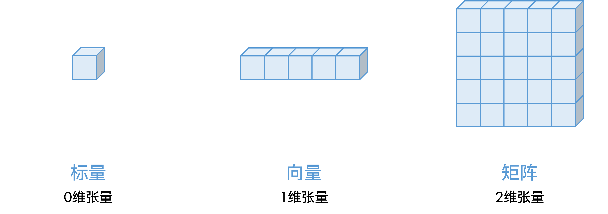

# 1 张量

## 1.1 张量及张量的构造

在PyTorch中，张量（tensor）是数表。



在PyTorch中，使用`torch.Tensor`类储存张量。每个张量具有如下重要属性：

（1）`data`：张量的值；

（2）`shape`：张量的形状；

（3）`dtype`：张量的数据类型；

（4）`device`：张量的计算设备。

可以使用一些PyTorch的函数来初始化特殊的张量：

（1）`torch.tensor(data, **…)`：传入数表（`List`或`np.ndarray`等），以数表为数据构建张量。其`shape`属性与传入数据的`shape`属性一致，`dtype`属性在由参数指定的情况下使用参数指定的数据类型，否则由传入的数据自行判断数据类型，`device`属性在由参数指定的情况下使用参数指定的计算设备，否则使用`torch.device("cpu")`。

（2）`torch.zeros(*shape, **…)`：传入形状，构建该形状的全0张量。

（3）`torch.ones(*shape, **…)`：传入形状，构建该形状的全1张量。

（4）`torch.full(shape, fill_value, **…)`：传入形状和值，构建该形状的张量，并给每个元素赋上该值。

（5）`torch.rand(*shape, **…)`：传入形状，构建该形状的张量，每个元素都是区间为$[0,1)$的随机值。

（6）`torch.zeros_like(input, **…)`：传入一个张量，构建与其形状、数据类型和计算设备均一致的全0张量。

（7）`torch.ones_like(input, **…)`：传入一个张量，构建与其形状、数据类型和计算设备均一致的全1张量。

（8）`torch.full_like(input, fill_value, **…)`：传入一个张量和一个值，构建与该张量形状、数据类型和计算设备均一致的新张量，并给每个元素赋上该值。

## 1.2 张量的数据类型

张量存在9种常见的数据类型：

| 数据长度\\数据格式 | 无符号整型 | 有符号整型 | 浮点型 |
| :---: | :---: | :---: | :---: |
| 8位 | `torch.uint8` | `torch.int8` | |
| 16位 | | `torch.int16` / `torch.short` | `torch.float16` / `torch.half` |
| 32位 | | `torch.int32` / `torch.int` | `torch.float32` / `torch.float` |
| 64位 | | `torch.int64` / `torch.long` | `torch.float64` / `torch.double` |

除此之外，还有`torch.bool`类型，其数据格式和长度与`torch.uint8`类型一致，但其元素仅有`True`和`False`两个值，也无法参与任何数值计算。

## 1.3 张量的数据类型转换和计算设备转换

统一使用`Tensor.to()`函数来改变张量的数据类型和计算设备：

例如： `a = torch.ones(3, 4)`。

（1）改变数据类型为`torch.float64`：

```python
a = a.to(dtype = torch.float64)
```

（2）改变计算设备为`torch.device("cuda:0")`：

```python
a = a.to(device = torch.device("cuda:0"))
```

（3）同时改变两个属性：

```python
a = a.to(dtype = torch.float64, device = torch.device("cuda:0"))
```

（4）存在另一张量`b = torch.tensor(2.0, dtype = torch.float64, device = torch.device("cuda:0"))`，要求使`a`的数据类型和计算设备与`b`一致：

```python
a = a.to(b)
```

除此之外，PyTorch定义了`a.int()`，`a.long()`，`a.short()`，`a.bool()`，`a.cpu()`，`a.cuda()`等方法，用于快速将数据转换为对应的数据类型和计算设备。

## 1.4 张量的计算

（1）逐元素数值计算

| 运算符 | 函数 | 解释 |
| :---: | :---: | :---: |
| `+` | `torch.add(a, b)` | 逐元素相加 |
| `-` | `torch.sub(a, b)` | 逐元素相减 |
| `*` | `torch.mul(a, b)` | 逐元素相乘 |
| `/` | `torch.div(a, b)` | 逐元素相除 |
| `**` | `torch.pow(a, b)` | 逐元素乘方 |
| `%` | `torch.fmod(a, b)` | 逐元素取余 |
| | `torch.log(a)` | 以自然数$e$为底，逐元素取对数 |
| | `torch.abs(a)` | 对张量取绝对值 |

（2）矩阵乘

| 运算符 | 函数 | 解释 |
| :---: | :---: | :---: |
| `@` | `torch.mm(a, b)` | 矩阵相乘 |
| | `torch.bmm(a, b)` | 批次矩阵相乘 |
| | `torch.einsum(rule, a, b)` | 爱因斯坦求和，即矩阵的自定义规则运算 |

**注意：** 批次（batch）在张量中一般用一个维度来表示，代表同时处理的张量个数，是一个抽象概念。
矩阵乘要求前一个张量的第二个维度与后一个张量的第一个维度相等，即`[H, C], [C, W] -> [H, W]`；批次矩阵乘在此基础上加一个批大小，即`[B, H, C], [B, C, W] -> [B, H, W]`。

（3）逐元素按位运算

| 运算符 | 函数 | 解释 |
| :---: | :---: | :---: |
| `&` | `torch.bitwise_and(a, b)` | 逐元素逐位与 |
| `\|` | `torch.bitwise_or(a, b)` | 逐元素逐位或 |
| `~` | `torch.bitwise_not(a)` | 逐元素逐位取反 |
| `^` | `torch.bitwise_xor(a, b)` | 逐元素逐位异或 |
| `<<` | `torch.bitwise_left_shift(a, b)` | 逐元素逐位左移 |
| `>>` | `torch.bitwise_right_shift(a, b)` | 逐元素逐位右移

（4）逐元素比较运算

| 运算符 | 函数 | 解释 |
| :---: | :---: | :---: |
| `==` | `torch.eq(a, b)` | 逐元素比较是否相等 |
| `!=` | `torch.ne(a, b)` | 逐元素比较是否不等 |
| `<` | `torch.lt(a, b)` | 逐元素比较是否小于 |
| `<=` | `torch.le(a, b)` | 逐元素比较是否小于等于 |
| `>` | `torch.gt(a, b)` | 逐元素比较是否大于 |
| `>=` | `torch.ge(a, b)` | 逐元素比较是否大于等于 |

**注意：** 比较运算返回的是一个数据类型为`torch.bool`的张量。

（5）张量的统计

| 函数 | 解释 |
| :---: | :---: |
| `torch.min(a)` | 统计张量的全局最小值 |
| `torch.min(a, dim = d)` | 在张量的某个维度上统计最小值 |
| `torch.argmin(a)` | 统计张量在最小值处的索引 |
| `torch.min(a, b)` | 逐元素比较两个张量，将最小的那个赋值给新的张量 |
| `torch.max(a)` | 统计张量的全局最大值 |
| `torch.max(a, dim = d)` | 在张量的某个维度上统计最大值 |
| `torch.argmax(a)` | 统计张量在最大值处的索引 |
| `torch.max(a, b)` | 逐元素比较两个张量，将最大的那个赋值给新的张量 |
| `torch.mean(a)` | 统计张量的全局平均值 |
| `torch.mean(a, dim = d)` | 在张量的某个维度上统计平均值 |
| `torch.var(a)` | 统计张量的全局方差 |
| `torch.var(a, dim = d)` | 在张量的某个维度上统计方差 |
| `torch.sum(a)` | 张量求和（做累加） |
| `torch.sum(a, dim = d)` | 在张量的某个维度上求和（做累加） |
| `torch.cumsum(a, dim = d)` | 在张量的某个维度上求和（做累加），并逐元素保留累加结果 |
| `torch.prod(a)` | 张量累乘 |
| `torch.prod(a, dim = d)` | 在张量的某个维度上做累乘 |
| `torch.cumprod(a, dim = d)` | 在张量的某个维度上做累乘，并逐元素保留累乘结果 |

## 1.5 张量的取值、赋值、子张量和变形

例如：`a = torch.rand(3, 4)`。

（1）获取`a`的维数

```python
d = a.ndim
```

结果为2，表示`a`为一个二维矩阵。

（2）取单个值（标量）

```python
b = a[0, 0]
```

取张量`a`中位置为`[0, 0]`的张量，返回一个标量（缩减2个维度，即`b.ndim = 0`）。

**注意：** 在通过索引取值时，索引中出现了几个整数，表示结果张量的维数要减去几。

（3）取子张量

```python
b = a[0]
```

取第0行的所有值，返回一个向量（缩减1个维度，`b.ndim = 1`）。

```python
b = a[:, 0]
```

取第0列的所有值，返回一个向量（缩减1个维度，`b.ndim = 1`）。

**注意：** 这里的`:`代表将该维度的所有索引遍历。如果最后的几个维度均需遍历，可以省略最后几个维度的`:`，如上例中取行向量。

```python
b = a[1:, :2]
```

取第1行及之后行，第2列之前列的所有值，返回一个矩阵（不缩减维度，`b.ndim = 2`）。

```python
b = a[:, 1::2]
```

从第1列开始，每隔1列取值，返回一个矩阵（不缩减维度，`b.ndim = 2`）。

**注意：** 冒号`:`代表切片（slice），最多出现两个冒号，隔开3个数字，即索引分别以`:`，`::`，`start:`，`:stop`，`start:stop`，`start::step`，`:stop:step`或`start:stop:step`的形式出现，代表间隔`step`取下标`start`开始（包括`start`）到`stop`为止（不包括`stop`）的所有元素。切片、列表等具备多个值的元素并不会改变子张量的维度。

```python
b = a[..., 0]
```

取最后一维的索引为0的所有值（缩减1个维度，`b.ndim = 1`）。

**注意：** 省略号`...`代表前面所有的维度均为`:`，省略号前出现的索引代表针对最先几个维度的索引，省略号后出现的索引代表针对最后几个维度的索引。

（4）维度扩张

```python
b = a[None]
```

在`a`的最前维度加一维，`b.shape = torch.Size([1, 3, 4])`，`.ndim = 3`。

```python
b = a[:, None]
```

在`a`的第二个维度前加一维，`b.shape = torch.Size([3, 1, 4])`，`.ndim = 3`。

```python
b = a[..., None]
```

在`a`的所有维度后加一维，`b.shape = torch.Size([3, 4, 1])`，`.ndim = 3`。

（5）条件判断

```python
b = a[a > 0.5]
```

取`a`中所有`a > 0.5`的元素，并返回一个满足条件的元素组成的一维张量（`b.ndim = 1`）。

**注意：** 当传入的索引是一个`dtype = torch.bool`的张量时，子张量的维度会根据索引张量的维度变化。即令`res = src[cond]`，则`res.ndim = src.ndim - cond.ndim + 1`。即：当其传入的索引张量为1维时，不会改变输出张量的维度，当其传入的张量为2维时，输出张量的维度会比原张量少1。以此类推，当其传入的索引张量维度等于原张量时，输出张量为1维。

（6）条件下标

```python
b = torch.argwhere(a > 0.5)
```

先执行判断`a > 0.5`得到一个数据类型为`torch.bool`的张量，再返回该张量值为`True`的元素下标，返回的张量形状为`[n, a.ndim]`，其中`n`为`a > 0.5`中值为`True`的元素个数。

（7）赋值

```python
a[:] = 3.0
```

将`a`的所有值设为`3.0`。

```python
a[:, 1] = 3.0
```

将`a`的第一列设为`3.0`。


```python
a[:, 2] = a[:, 1] + 2.0
```

将`a`的第二列设为第一列加`2.0`后的结果。

（8）复制张量

所有的`torch.Tensor`对象本质上都是一个包含数据首地址的指针、其属性和方法的结构体。如下所示：

```cpp
class Tensor<T> {
    int ndim;
    unsigned long* shape;
    torch::dtype dtype;
    torch::device device;
    T* data;
    ... // 其余方法
}
```

因此，以上取值操作，包括取元素、取子张量等，本质上都是通过计算改变其数据指针及其它基本类型，并将计算得到的属性赋值给一个新的对象，并不会开辟新的内存空间储存张量的数据。若直接改变子张量（`b`）的值，原张量（`a`）的值也会被改变。若希望两张量彼此之间保持独立，则需要通过`Tensor.clone()`函数开辟一块新的内存空间，复制原张量。即：

```python
b = a.clone()
```

该方法会创造一个所有属性与数据均与`a`一致的张量`b`，只不过`b`的内存空间与`a`的内存空间互相独立，对`b`的更改不会使得`a`也被一并更改。也可以通过

```python
b = 0.0 + a[:, 1]
```

利用运算符复制子张量（`a[:, 1]`）到新张量（`b`）。

（9）变形，但不改变元素索引

```python
b = a.reshape(2, 6)
```

或

```python
b = a.view(2, 6)
```

将张量`a`的形状变为`torch.size([2, 6])`，并赋值给`b`。该方法不开辟新的内存空间，对其中一个张量的更改会反映在另一张量上。

**注意：** 在PyTorch的底层中，张量的所有元素是以一维数组的方式进行存储的。传入的多个索引会被计算为一维索引，并通过一维索引查找元素。假设传入的索引为 $I=\{i_{1}, i_{2}, ..., i_{n}\}$，原张量形状为 $S=\{s_{1}, s_{2}, ..., s_{n}\}$，则一维索引的计算公式为：

$$p=\sum_{j=1}^{n}{\left(i_{j}\prod_{k=j+1}^{n}{s_{k}}\right)}$$

例如，`a.shape = torch.Size([3, 4])`，则`a[1, 2]`为`a`的第`p = 1 * 4 + 2 = 6`个元素。“不改变元素索引”的意思即为不改变元素的一维索引。即：若某个元素在张量`a`中的一维索引为`p`，则其在张量`b`中的一维索引仍为`p`。

```python
b = a.flatten()
```

将`a`展开为一维，并将展开后的张量赋值给`b`。

（10）变形，且改变元素索引

```python
b = a.swapaxes(0, 1)
```

将`a`中的第`0`个坐标轴与第`1`个坐标轴互换。即`b[j, i]=a[i, j]`。

```python
b = a.permute(1, 0)
```

将`a`的坐标轴按照传入的坐标轴顺序重新排布。即：若张量`c`满足`c.shape = torch.Size([2, 3, 4])`，则`d = c.permute(1, 2, 0)`后，`d.shape = torch.Size([3, 4, 2])`，且`d[j, k, i] = c[i, j, k]`。

## 1.6 线性代数

PyTorch提供了很多关于张量的线性代数操作。

```python
a_inv = torch.linalg.inv(a)
```

求`a`的逆矩阵，`a`必须为方阵（形状为`[N, N]`或`[B, N, N]`）。

```python
a_det = torch.linalg.det(a)
```

求`a`的行列式，`a`必须为方阵（形状为`[N, N]`或`[B, N, N]`）。

```python
eig_val, eig_vec = torch.linalg.eig(a)
```

求`a`的特征值和特征向量，`a`必须为方阵（形状为`[N, N]`或`[B, N, N]`）。返回值是一个张量元组，其中前值为特征值（形状为`[N]`或`[B, N]`），后值为特征向量（形状为`[N, N]`或`[B, N, N]`，最后一维为向量）。