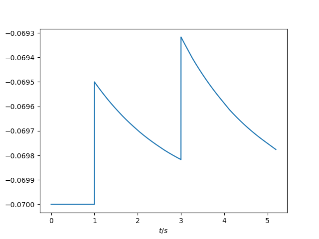
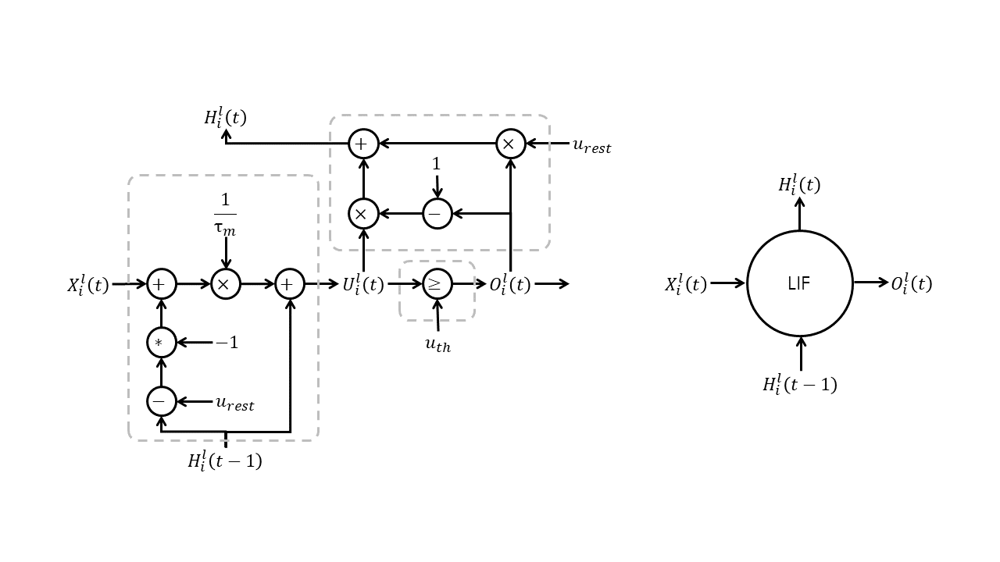

# 1 脉冲神经元模型

## 1.1 动作电位与脉冲的产生

高中生物学提到：在神经细胞处于静息状态时，$K^{+}$离子外流，使膜内外阳离子浓度高于膜内，细胞膜两侧的电位表现为内负外正，称之为静息电位；当神经细胞感受到刺激时，细胞膜对$Na^{+}$的通透性增强，$Na^{+}$内流，此时膜内外电位表现为内正外负，称为动作电位。由于兴奋部位和未兴奋部位电位差的存在，动作电位会随着轴突向前传导，最后在突触处导致神经递质的释放，促进或抑制下游神经元的神经兴奋。


动作电位在胞体中产生。动作电位的产生过程可被概括为如下3个阶段：

1. 去极化：当兴奋性神经元的电位超过阈电位时，膜电位会在极短的时间内从内负外正转变为内正外负，兴奋产生并向外传导。
2. 超极化：膜电位重新回到内正外负的状态，并且膜内外电位差较静息电位更低。
3. 不应期：离子泵缓慢将膜电位拉回静息电位，在此期间，神经元不会再产生任何冲动。


动作电位的产生具有如下特点：

1. 全或无：在同一细胞中，动作电位的大小（膜内外电位差）与所受到刺激的强度无关。
2. 不衰减：在同一细胞中，动作电位的大小与其被传导的距离无关。
3. 不应期：在细胞膜电位重新回到并保持静息电位前，细胞不会产生新的兴奋。

由于去极化和超极化的时间都十分短暂，加上动作电位的特点，将产生的兴奋称为一个脉冲（spike）。在同一神经元中，不同时间产生的脉冲一致。脉冲在轴突上传导，最终到达突触，并引发下游神经元电位的变化。

## 1.2 霍奇金-赫胥黎神经元模型

霍奇金-赫胥黎模型（HH模型）在1952年由霍奇金和赫胥黎提出，因为其在解释动作电位的产生和传播方面的奠基性贡献，两人在1963年被授予诺贝尔医学奖。原版的HH模型是基于对乌贼的神经刺激电位数据总结得出，随后成为许多不同生理结构中的神经细胞的模型雏形。


HH模型将细胞膜看作一个具有膜电容$C_{m}$的模型，泄露、离子$K^{+}$和$Na^{+}$的流动都会对膜电位产生一定影响。细胞膜会倾向于维持在静息电位$V_{rest}$。其用公式表示如下：

$$I_{m}=C_{m}\frac{dV_{m}}{dt}+g_{l}(V_{m}-v_{L})+g_{Na^{+}}m^{3}h(V_{m}-v_{Na^{+}})+g_{K^{+}}n^{4}(V_{m}-v_{K^{+}})$$

其中$m$、$n$与$h$均由含$V_{m}$的一阶微分方程得出。

## 1.3 LIF模型：简化的HH模型，脉冲神经元最常见的模型

Leaky Integrate-and-Fire （LIF）模型由HH模型简化而来。将HH模型公式中的参数$m$、$n$与$h$忽略不计，再稍加变形可得到：

$$I_{m}=C_{m}\frac{dV_{m}}{dt}+g_{m}(V_{m}-v_{rest})$$

其中，

$$g_{m}=g_{l}+g_{Na^{+}}+g_{K^{+}}$$

$$v_{rest}=\frac{g_{l}v_{L}+g_{Na^{+}}v_{Na^{+}}+g_{K^{+}}v_{K^{+}}}{g_{m}}$$

记时间常数$τ_{m}=\frac{C_{m}}{g_{m}}$，将方程两侧同除以$g_{m}$，可得到如下方程：

$$\frac{I_{m}}{g_{m}}=τ_{m}\frac{dV_{m}}{dt}+(V_{m}-v_{rest})$$

又由$g_{m}=\frac{1}{R_{m}}$，移项后可得到一阶微分方程：

$$τ_{m}\frac{dV_{m}}{dt}=-(V_{m}-v_{rest})+I_{m}R_{m}$$

此即为LIF神经元模型的一阶微分方程。使用python脚本模拟LIF神经元模型，如下所示：

```python
class LIF:
    def __init__(self, tau_m: float, u_rest: float) -> None:
        self.tau_m = tau_m
        self.u_rest = u_rest
        self.reset()
    
    def reset(self):
        self.u = self.u_rest
        self.t = -1.0
        self.records = []
    
    def next(self, t: float, s: float):
        if self.t < 0.0:
            dt = 0.0
        else:
            dt = t - self.t
        self.t = t
        du = (-(self.u - self.u_rest) + s) / self.tau_m * dt
        self.u += du
        self.records.append([t, self.u])
```

打印其膜电位$V_{m}$随时间$t$的变化如下所示：



从图中可以看出，当膜电位不超过阈电位时，其在刺激的作用下瞬间抬高自身的膜电位，随后随时间缓慢滑落回静息电位。

由于LIF神经元反应方程较为简单，且符合生物学神经元的特点，在当前脉冲神经网络（spiking neural networks，SNNs）的训练中，LIF是最为常见的神经元模型。

由于计算机难以计算连续的神经元模型，计算所使用的LIF模型为离散化后的LIF模型：令$dt=1$，将连续的时间离散化为一个一个等长的时间单位，称之为时间步（time step）；在此基础上，$dV_{m}=V_{m}(t)-V_{m}(t-1)$。LIF神经元离散化后的一阶反应差分方程如下所示：

$$V_{m}(t)-V_{m}(t-1)=\frac{1}{τ_{m}}[-[V_{m}(t-1)-v_{rest}]+R_{m}I_{m}(t)]$$

加入对脉冲生成的判断：

$$I_{s}(t)=Heaviside[V_{m}(t)-v_{th}]$$

与膜电位的重置：

$$V_{m}(t)=[1-I_{s}(t)]V_{m}(t)+I_{s}(t)v_{rest}$$

即为离散化后的LIF模型在一个时间步内的反应过程。其中Heaviside阶跃函数$Heaviside(x)$在$x \ge 0$时的值为$1$，在$x \lt 0$时的值为$0$。

LIF模型在一个时间步内的反应过程可被如下计算图描述：



其中$l$为层索引，表示其处于第$l$层；$i$为神经元索引，表示其为第$i$个神经元；$t$为当前时间步；$U$与$H$分别表示当前膜电位与历史膜电位，$X$为突触后电位（由输入脉冲与膜电导作用形成的电位），$O$为输出脉冲。

可将LIF神经元简记为

$$O_{i}^{l}(t),H_{i}^{l}(t)=LIF[X_{i}^{l}(t),H_{i}^{l}(t-1)]$$

## 1.4 脉冲神经元大家族的其他成员

### Integrate-and-Fire （IF）模型

IF模型的一阶反应微分方程为：

$$\frac{dV_{m}}{dt}=I_{m}R_{m}$$

其相较于LIF模型而言，减少了泄露过程。使用python脚本模拟LIF神经元模型，如下所示：

```python
class IF:
    def __init__(self, u_rest: float) -> None:
        self.u_rest = u_rest
        self.reset()
    
    def reset(self):
        self.u = self.u_rest
        self.t = -1.0
        self.records = []
    
    def next(self, t: float, s: float):
        if self.t < 0.0:
            dt = 0.0
        else:
            dt = t - self.t
        self.t = t
        du = s * dt
        self.u += du
        self.records.append([t, self.u])
```

打印其膜电位$V_{m}$随时间$t$的变化如下所示：


### Quadratic Integrate-and-Fire （QIF）模型

QIF模型的一阶反应微分方程为：

$$τ_{m}\frac{dV_{m}}{dt}=a_{0}(V_{m}-V_{rest})(V_{m}-V_{c})+I_{m}R_{m}$$

其使用二次函数代替$-(V_{m}-V_{rest})$完成脉冲的泄露过程。使用python脚本模拟QIF神经元模型，如下所示：

```python
class QIF:
    def __init__(self, tau_m: float, u_rest: float, u_c: float, a_0: float) -> None:
        self.tau_m = tau_m
        self.u_rest = u_rest
        self.u_c = u_c
        self.a_0 = a_0
        self.reset()
    
    def reset(self):
        self.u = self.u_rest
        self.t = -1.0
        self.records = []
    
    def next(self, t: float, s: float):
        if self.t < 0.0:
            dt = 0.0
        else:
            dt = t - self.t
        self.t = t
        du = (self.a_0 * (self.u - self.u_rest) * (self.u - self.u_c) + s) / self.tau_m * dt
        self.u += du
        self.records.append([t, self.u])
```

打印其膜电位$V_{m}$随时间$t$的变化如下所示：


### Exponential Integrate-and-Fire （ExpIF）模型

ExpIF模型的一阶反应微分方程为：

$$τ_{m}\frac{dV_{m}}{dt}=-(V_{m}-V_{rest})+Δ_{T}e^{\frac{V_{m}-v_{T}}{Δ_{T}}}+I_{m}R_{m}$$

其加入了一个微小偏置$Δ_{T}e^{\frac{V_{m}-v_{T}}{Δ_{T}}}$，用于修正因离子通透性随电位变化导致微小电导差异的影响。

### Adaptive Exponential Integrate-and-Fire （AdEx）模型

ExpIF模型的一阶反应微分方程为：

$$τ_{m}\frac{dV_{m}}{dt}=-(V_{m}-V_{rest})+Δ_{T}e^{\frac{V_{m}-v_{T}}{Δ_{T}}}-w_{m}R_{m}+I_{m}R_{m}$$

$$τ_{w}\frac{dw_{m}}{dt}=a(V_{m}-V_{rest})-w_{m}+bτ_{w}\sum_{t^{(f)}}{δ(t-t^{(f)})}$$

其中$t^{(f)}$为在当前时间步之前发放过的所有脉冲发放时的时间步。其在ExpIF模型的基础上，通过对之前所发放脉冲的统计，降低之后对脉冲的发放频率，减少对固定不变的模式反复的信号输出。

### Izhikevich模型

Izhikevich模型的一阶反应微分方程为：

$$\frac{dV_{m}}{dt}=0.04V_{m}^{2}+5V_{m}+140-w_{m}+I_{m}$$

$$\frac{dw_{m}}{dt}=a(bV_{m}-w_{m})$$

其在QIF模型的基础上，增加了适应变量。其各个系数由对某个皮层神经元的拟合得出，在实际应用场景中，可以根据模型需要适当修改。