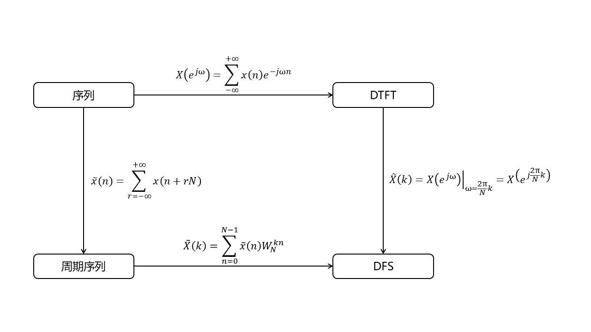
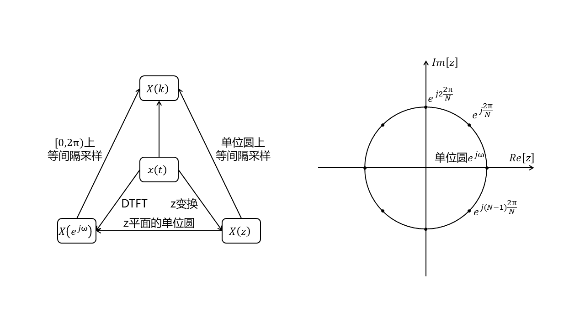
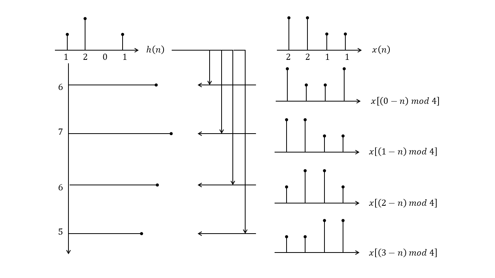
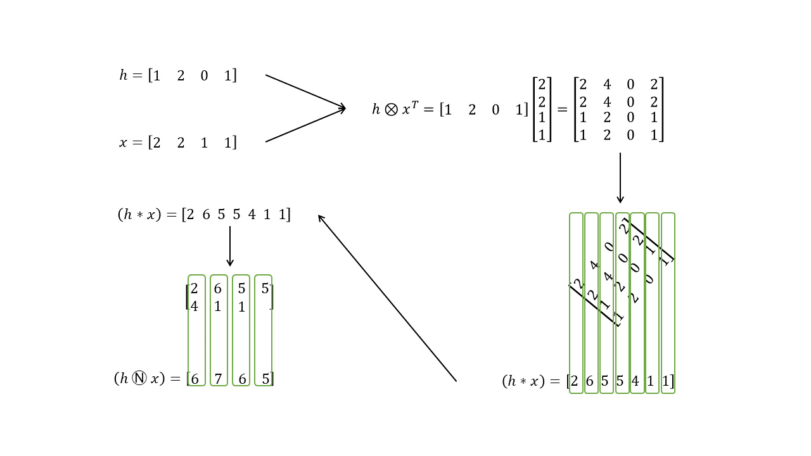
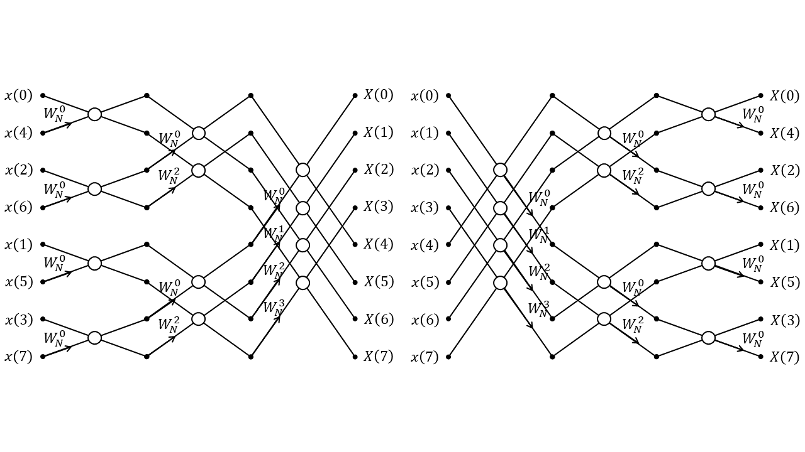
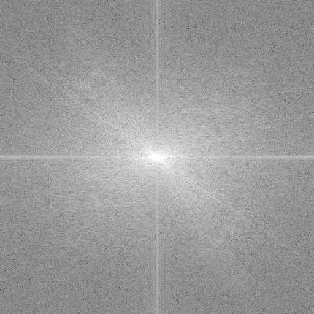

# 2 离散傅里叶变换与快速傅里叶变换

## 2.1 离散傅里叶级数

上一节说到，傅里叶级数的公式为

$$x(t)=\sum_{n=-∞}^{n=∞}{X(nΩ_{0})e^{jnΩ_{0}t}}$$

将频域离散化，得到离散傅里叶级数

$$\tilde{x}(n)=\frac{1}{N}\sum_{n=0}^{N-1}{\tilde{X}(k)e^{j(\frac{2π}{N})kn}}$$

其相当于把离散时间傅里叶逆变换

$$x(n)=\frac{1}{2π}\int_{-π}^{π}{X(e^{jω})e^{jωn}dω}$$

中$ω$用位于$[0,2π)$上均匀分布的$N$个离散值采样得到。

由此，我们可以得到离散傅里叶级数（DFS）的公式为

$$\tilde{X}(k)=DFS[\tilde{x}(n)]=\sum_{n=0}^{N-1}{\tilde{x}(n)e^{-j\frac{2π}{N}kn}}=\sum_{n=0}^{N-1}{\tilde{x}(n)W_{N}^{kn}}$$

其反变换的公式为

$$\tilde{x}(n)=IDFS[\tilde{X}(k)]=\frac{1}{N}\sum_{k=0}^{N-1}{\tilde{X}(k)e^{j\frac{2π}{N}kn}}=\frac{1}{N}\sum_{k=0}^{N-1}{\tilde{X}(k)W_{N}^{-kn}}$$

其中记$W_{N}=e^{-j\frac{2π}{N}}$，$W_{N}^{kn}=e^{-j\frac{2π}{N}kn}$。

离散傅里叶级数表示在时域和频域之间存在**对偶性**，即时域上的周期序列，其离散傅里叶级数在频域上仍是周期序列。

对于周期为$N$的周期序列$x(n)$来说，取其位于$[0,N)$的一段，称之为**主值序列**。周期序列的DFS系数等于其主值序列DTFT的采样值。

离散傅里叶级数具有如下性质：

（1）线性

$$DFS[a\tilde{x}(n)+b\tilde{y}(n)]=a\tilde{X}(k)+b\tilde{Y}(k)$$

（2）序列移位

$$DFS[\tilde{x}(n+n_{0})]=W_{N}^{-n_{0}k}\tilde{X}(k)=e^{j\frac{2π}{N}n_{0}k}\tilde{X}(k)$$

（3）对偶性

若$\tilde{x}(n)⇔\tilde{X}(k)$，则$\tilde{X}(k)⇔N\tilde{x}(-n)$。

（4）对称性

当$\tilde{x}(n)$为周期为$N$的实序列，则（设$x_{e}(n)=Re[x(n)]$，$x_{o}(n)=jIm[x(n)]$）:

\[1\]共轭对称：$\tilde{X}(k)=\tilde{X}^{*}(-k)=DFS[\tilde{x}^{*}(n)]$，$\tilde{X}(-k)=\tilde{X}^{*}(k)=DFS[\tilde{x}^{*}(-n)]$；

\[2\]实部为偶函数：$Re[\tilde{X}(k)]=Re[\tilde{X}(-k)]=DFS[\tilde{x}_{e}(n)]$，$DFS[Re[\tilde{x}(n)]]=\tilde{X}_{e}(k)$；

\[3\]虚部为奇函数：$Im[\tilde{X}(k)]=-Im[\tilde{X}(-k)]=-jDFS[\tilde{x}_{o}(n)]$，$DFS[jIm[\tilde{x}(n)]]=\tilde{X}_{o}(k)$；

\[4\]幅度为偶函数：$|\tilde{X}(k)|=|\tilde{X}(-k)|$

\[5\]相位为奇函数：$arg[\tilde{X}(k)]=-arg[\tilde{X}(-k)]$

（5）周期卷积

$$\tilde{f}(n)=\sum_{m=0}^{N-1}{\tilde{x}(m)\tilde{y}(n-m)}⇔\tilde{F}(k)=\tilde{X}(k)\tilde{Y}(k)$$



离散傅里叶级数$\tilde{X}(k)$相当于**将$X(e^{jω})$在$ω=\frac{2πk}{N}$处采样**得到，也可以看作是**在z平面单位圆上$x(n)$的z变换$X(z)$的$N$个等间隔点采样**。



与时域的采样率过低会造成频谱混叠类似，对于离散时间傅里叶变换转换为的离散傅里叶级数，频域的欠采样同样也会造成时域的混叠。解决方法即为提高频域的采样率。

## 2.2 离散傅里叶变换

假设一个周期为$N$的周期序列$\tilde{x}(n)$，其离散傅里叶级数为$\tilde{X}(k)$。现在我们仅保留它位于范围$[0,N)$的子序列，我们称之为**主值序列**。记$\tilde{x}(n)$的主值序列为$x(n)$，我们可以得到

$$\tilde{x}(n)=x(n\mod{N})$$

则主值序列的离散傅里叶变换

$$x(n)⇔X(k)$$

即为其离散傅里叶级数的主值序列：

$$\tilde{X}(k)=X(k\mod{N})$$

因此我们可以得到离散傅里叶变换的计算公式为：

$$X(k)=\sum_{n=0}^{N-1}{x(n)W_{N}^{kn}},0≤k≤N-1$$

其逆变换的计算公式为：

$$x(n)=\frac{1}{N}\sum_{k=0}^{N-1}{X(k)W_{N}^{-kn}},0≤n≤N-1$$

需要注意的是，$x(n)$与$X(k)$有着同等的长度$N$。$X(k)$本质是有限长序列$x(n)$的频谱$X(e^{jω})$在一个周期$0≤ω<2π$上的$N$点采样。当$N$大于序列的实际长度$M$时，$X(k)$可看作是$x(n)$的频谱。离散傅里叶变换中，时域和频域都取其中一个周期来表示，因此离散傅里叶变换中隐含着周期性。

可以使用线性变换形式表示IDFT的计算：设$\vec{x}=\{x(t)\}_{N}$，$\vec{X}=\{X(k)\}_{N}$，且

$$
D_{N}=
\begin{bmatrix}
1 & 1 & 1 & \cdots & 1 \\\\
1 & W_{N}^{1} & W_{N}^{2} & \cdots & W_{N}^{N-1} \\\\
1 & W_{N}^{2} & W_{N}^{4} & \cdots & W_{N}^{2(N-1)} \\\\
\vdots & \vdots & \vdots & \ddots & \vdots \\\\
1 & W_{N}^{N-1} & W_{N}^{2(N-1)} & \cdots & W_{N}^{(N-1)(N-1)} \\\\
\end{bmatrix}
$$

其逆矩阵

$$
D_{N}^{-1}=\frac{1}{N}
\begin{bmatrix}
1 & 1 & 1 & \cdots & 1 \\\\
1 & W_{N}^{-1} & W_{N}^{-2} & \cdots & W_{N}^{-(N-1)} \\\\
1 & W_{N}^{-2} & W_{N}^{-4} & \cdots & W_{N}^{-2(N-1)} \\\\
\vdots & \vdots & \vdots & \ddots & \vdots \\\\
1 & W_{N}^{-(N-1)} & W_{N}^{-2(N-1)} & \cdots & W_{N}^{-(N-1)(N-1)} \\\\
\end{bmatrix}
$$

则离散傅里叶变换可以被表示为

$$\vec{X}=D_{N}\vec{x},\vec{x}=D_{N}^{-1}\vec{X}$$

离散傅里叶变换具有和离散傅里叶级数相似的性质：

（1）线性

$$DFT[ax(n)+by(n)]=aX(k)+bY(k)$$

（2）位移性质

$$x(n-n_{0})⇔W_{N}^{kn_{0}}X[k],W_{N}^{-k_{0}n}x(n)⇔X[(k-k_{0})\mod{N}]$$

（3）共轭对称性

$$DFT[x^{*}(n)]=X^{*}[(N-k)\mod{N}]$$

（4）实部与虚部的DFT对称性（设$x_{e}(n)=Re[x(n)]$，$x_{o}(n)=jIm[x(n)]$）：

$$Re[X(k)]=DFT[x_{e}(n)],jIm[X(k)]=DFT[x_{o}(n)]$$

（5）反转性质

$$x[(-n)\mod{N}]⇔X[(-k)\mod{N}]$$

（6）循环卷积

定义循环卷积为

$$f(n)=[\sum_{m=0}^{N-1}{x(m)y[(n-m)\mod{N}]}]=(xⓃy)(n)$$

其中$Ⓝ$表示循环卷积运算符。两个长度为$N$的序列循环卷积的长度也为$N$。



其满足性质

$$(xⓃy)(n)⇔X(k)Y(k)$$

（7）帕塞瓦定理

$$\sum_{n=0}^{N-1}{|x(n)|^{2}}⇔\frac{1}{N}\sum_{n=0}^{N-1}{|X(k)|^{2}}$$

在刚刚说明DFT时，提到了“循环卷积”这一概念。两个长度为$N$的有限长序列作线性卷积，结果为一个长度为$2N-1$的序列，而它们作循环卷积，其结果仍旧为一个长度为$N$的序列。“循环卷积”这一概念是针对DFT而提出的，循环卷积的值也可以由两个序列的线性卷积转化而来。此处采用重叠相加法（假设输入序列为$x(n)$，卷积核为$h(n)$）：

（1）若$x(n)$和$h(n)$长度不等，则将较短的那个补0至长度相等，记长度为$N$；

（2）计算线性卷积$(h*x)(n)=\sum_{i=0}^{n-1}{h(i)x(n-i)}$；

（3）将线性卷积（长度为$2N-1$）折成长度为$N$的前半段和长度为$N-1$的后半段，将其对应位置元素相加，最终得到长度为$N$的循环卷积结果。



正如时域上的采样可以通过内插大致还原，通过DFT进行的频域上的采样$X(k)$也可以通过内插大致还原至$X(z)$。设原序列$x(t)$的长度为$M$，样本序列的离散傅里叶变换$X(k)$的长度为$N$，则当$N≥M$时，还原的序列不会失真；否则只能通过不断增大$N$的值来做到近似还原。由$X(k)$还原为$X(z)$的公式如下：

$$X(z)=\sum_{k=0}^{N-1}{X(k)\frac{1-z^{-N}}{N(1-W_{N}^{-k}z^{-1})}}$$

记内插函数

$$Φ_{K}(Z)=\frac{1}{N}\frac{z^{N}-1}{z^{N-1}(z-W_{N}^{-k})}$$

则内插的公式可以记为

$$X(z)=\sum_{k=0}^{N-1}{X(k)Φ_{K}(Z)}$$

使用离散傅里叶变换还原连续傅里叶变换的过程中，由于只知道采样点处的频谱，不知道两谱线间的具体情况，因此还原出的连续频谱会与原频谱出现偏差，称之为“栅栏效应”。增大频域上采样点的个数，可以使频率的分辨率变小，缓解这一问题。

## 2.3 快速傅里叶变换

拿长度$N=4$的序列举例：其离散傅里叶变换计算公式如下：

$$
\begin{bmatrix}
X(0) \\\\
X(1) \\\\
X(2) \\\\
X(3)
\end{bmatrix}
=
\begin{bmatrix}
W^{0} & W^{0} & W^{0} & W^{0} \\\\
W^{0} & W^{1} & W^{2} & W^{3} \\\\
W^{0} & W^{2} & W^{4} & W^{6} \\\\
W^{0} & W^{3} & W^{6} & W^{9}
\end{bmatrix}
\begin{bmatrix}
x(0) \\\\
x(1) \\\\
x(2) \\\\
x(3)
\end{bmatrix}
$$

其计算量为$O(n^{2})$，利用$W_{N}^{nk}$的周期性$W_{N}^{n(k+N)}=W_{N}^{nk}$、共轭对称性$W_{N}^{-nk}=W_{N}^{(N-n)k}$和性质$W_{N}^{k+\frac{N}{2}}=-W_{N}^{k}$，、
由进一步推导，可以将矩阵拆分如下：

$$
\begin{bmatrix}
X(0) \\\\
X(2) \\\\
X(1) \\\\
X(3)
\end{bmatrix}
=
\begin{bmatrix}
1 & W^{0} & 0 & 0 \\\\
1 & W^{2} & 0 & 0 \\\\
0 & 0 & 1 & W_{1} \\\\
0 & 0 & 1 & W^{3}
\end{bmatrix}
\begin{bmatrix}
1 & 0 & W^{0} & 0 \\\\
0 & 1 & 0 & W^{0} \\\\
1 & 0 & W^{2} & 0 \\\\
0 & 1 & 0 & W^{2}
\end{bmatrix}
\begin{bmatrix}
x(0) \\\\
x(1) \\\\
x(2) \\\\
x(3)
\end{bmatrix}
$$

这便是快速傅里叶变换的理论基础。

对于长度为2的整数次方，即$N=2^{M}$的序列，快速傅里叶计算可以表示为$M$层的蝶形运算。下面以长度为$2^{3}=8(M=3)$的序列作为例子讲解：



共有两种蝶形运算的方法。第一种方法 **（按时间抽取的FFT算法）** 如下所示：

（1）将序列按照“索引为偶数的第一组，索引为奇数的第二组”的原则，等分成两个子序列；将各个子序列按照同样的原则等分，递归直到每个序列中只有两个元素为止。

$$
\begin{bmatrix}
x(0)_{0} & x(1)_{1} & x(2)_{2} & x(3)_{3} & x(4)_{4} & x(5)_{5} & x(6)_{6} & x(7)_{7}
\end{bmatrix}
$$

$$↓$$

$$
\begin{bmatrix}
x(0)_{0} & x(2)_{1} & x(4)_{2} & x(6)_{3}
\end{bmatrix}
\begin{bmatrix}
x(1)_{0} & x(3)_{1} & x(5)_{2} & x(7)_{3}
\end{bmatrix}
$$

$$↓$$

$$
\begin{bmatrix}
x(0)_{0} & x(4)_{1}
\end{bmatrix}
\begin{bmatrix}
x(2)_{0} & x(6)_{1}
\end{bmatrix}
\begin{bmatrix}
x(1)_{0} & x(5)_{1}
\end{bmatrix}
\begin{bmatrix}
x(3)_{0} & x(7)_{1}
\end{bmatrix}
$$

（2）对于最后分解出的长度为2的每个子序列，将其第0个元素与第1个元素进行蝶形运算：

$$
\begin{matrix}
x_{0}(n) & & & & x_{0}(n)+W_{N}^{0}x_{1}(n) \\\\
 & ╲ & & ╱ & \\\\
 & & ╳ & & \\\\
W_{N}^{0} & ↗ & & ╲ & \\\\
x_{1}(n) & & & & x_{0}(n)-W_{N}^{0}x_{1}(n)
\end{matrix}
$$

其中由于长度仅为2，每个子序列仅需进行1次蝶形运算，因此$W_{N}^{k}=W_{N}^{0}$；此处代入$N=8$，下同。经由4次蝶形运算，我们可以得到如下4个子序列：

$$
\begin{bmatrix}
x(0) & x(4)
\end{bmatrix}
\begin{bmatrix}
x(2) & x(6)
\end{bmatrix}
\begin{bmatrix}
x(1) & x(5)
\end{bmatrix}
\begin{bmatrix}
x(3) & x(7)
\end{bmatrix}
$$

$$↓$$

$$
\begin{bmatrix}
x(0)+W_{8}^{0}x(4) & x(0)-W_{8}^{0}x(4)
\end{bmatrix}
\begin{bmatrix}
x(2)+W_{8}^{0}x(6) & x(2)-W_{8}^{0}x(6)
\end{bmatrix}
\begin{bmatrix}
x(1)+W_{8}^{0}x(5) & x(1)-W_{8}^{0}x(5)
\end{bmatrix}
\begin{bmatrix}
x(3)+W_{8}^{0}x(7) & x(3)-W_{8}^{0}x(7)
\end{bmatrix}
$$

（3）对上一层计算出来的长度为$m/2$的各个子序列，将索引为偶数的序列与其后的索引为奇数的序列相拼接，得到长度为$m$的新序列：

$$
\begin{bmatrix}
x(0)+W_{8}^{0}x(4) & x(0)-W_{8}^{0}x(4)
\end{bmatrix}
\begin{bmatrix}
x(2)+W_{8}^{0}x(6) & x(2)-W_{8}^{0}x(6)
\end{bmatrix}
\begin{bmatrix}
x(1)+W_{8}^{0}x(5) & x(1)-W_{8}^{0}x(5)
\end{bmatrix}
\begin{bmatrix}
x(3)+W_{8}^{0}x(7) & x(3)-W_{8}^{0}x(7)
\end{bmatrix}
$$

$$↓$$

$$
\begin{bmatrix}
x(0)+W_{8}^{0}x(4) & x(0)-W_{8}^{0}x(4) & x(2)+W_{8}^{0}x(6) & x(2)-W_{8}^{0}x(6)
\end{bmatrix}
\begin{bmatrix}
x(1)+W_{8}^{0}x(5) & x(1)-W_{8}^{0}x(5) & x(3)+W_{8}^{0}x(7) & x(3)-W_{8}^{0}x(7)
\end{bmatrix}
$$

（3）对于长度为$m$的序列，将第$i$个值与第$\frac{m}{2}+i$个值（$i∈[0,\frac{m}{2})$）进行如下所示的蝶形运算：

$$
\begin{matrix}
x_{i}(n) & & & & x_{i}(n)+W_{N}^{\frac{Ni}{m}}x_{i+\frac{m}{2}}(n) \\\\
 & ╲ & & ╱ & \\\\
 & & ╳ & & \\\\
W_{N}^{\frac{Ni}{m}} & ↗ & & ╲ & \\\\
x_{i+\frac{m}{2}}(n) & & & & x_{i}(n)-W_{N}^{\frac{Ni}{m}}x_{i+\frac{m}{2}}(n)
\end{matrix}
$$

在蝶形运算中，参数$W_{N}^{k}$可以理解为在$[0,π)$（即$k∈[0,\frac{N}{2})$）上均匀取$\frac{m}{2}$个点，依次代入计算。所以第$i$个值与第$\frac{m}{2}+i$个值进行蝶形运算时，参数$k$的取值即为

$$k=\frac{N}{2}×\frac{i}{\frac{m}{2}}=\frac{Ni}{m}$$

（4）重复（2）（3），进行蝶形运算后拼接，直到对长度$m=N$的序列进行蝶形运算后，得到的结果即为所需要的快速傅里叶变换结果。

$$
\begin{bmatrix}
X(0) & X(1) & X(2) & X(3) & X(4) & X(5) & X(6) & X(7)
\end{bmatrix}
$$

第二种方法和第一种方法相似，但不同于第一种方法 **“拆分+（蝶形运算+拼接）”** ，第二种方法 **（按频率抽取的FFT算法）** 可以概括为 **“（蝶形运算+拆分）+调序”** ：

（1）对于长度为$m$的序列，将第$i$个值与第$\frac{m}{2}+i$个值（$i∈[0,\frac{m}{2})$）进行如下所示的蝶形运算：

$$
\begin{matrix}
x_{i}(n) & & & & x_{i}(n)+x_{i+\frac{m}{2}}(n) \\\\
 & ╲ & & ╱ & \\\\
 & & ╳ & & \\\\
 & ╱ & & ↘ & W_{N}^{\frac{Ni}{m}} \\\\
x_{i+\frac{m}{2}}(n) & & & & [x_{i}(n)-x_{i+\frac{m}{2}}(n)]W_{N}^{\frac{Ni}{m}}
\end{matrix}
$$

在蝶形运算中，参数$W_{N}^{k}$可以理解为在$[0,π)$（即$k∈[0,\frac{N}{2})$）上均匀取$\frac{m}{2}$个点，依次代入计算。所以第$i$个值与第$\frac{m}{2}+i$个值进行蝶形运算时，参数$k$的取值即为

$$k=\frac{N}{2}×\frac{i}{\frac{m}{2}}=\frac{Ni}{m}$$

（2）将进行蝶形运算后的序列拦腰拆分为两个序列，即前$\frac{m}{2}$个元素一个序列，后$\frac{m}{2}$个元素一个序列。

（3）重复（1）（2），直到获取$N$个长度为$1$的序列（单个元素），此时按照倒位序（将索引比特位颠倒后作为新索引）将输出重新排序，得到最后需要的快速傅里叶变换结果：

$$
\begin{matrix}
X(n)_{(000)^{(2)}} & X(n)_{(001)^{(2)}} & X(n)_{(010)^{(2)}} & X(n)_{(011)^{(2)}} & X(n)_{(100)^{(2)}} & X(n)_{(101)^{(2)}} & X(n)_{(110)^{(2)}} & X(n)_{(111)^{(2)}}
\end{matrix}
$$

$$↓$$

$$
\begin{matrix}
X((000)^{(2)})_{(000)^{(2)}} & X((100)^{(2)})_{(001)^{(2)}} & X((010)^{(2)})_{(010)^{(2)}} & X((110)^{(2)})_{(011)^{(2)}} & X((001)^{(2)})_{(100)^{(2)}} & X((101)^{(2)})_{(101)^{(2)}} & X((011)^{(2)})_{(110)^{(2)}} & X((111)^{(2)})_{(111)^{(2)}}
\end{matrix}
$$

$$↓$$

$$
\begin{bmatrix}
X(0) & X(4) & X(2) & X(6) & X(1) & X(5) & X(3) & X(7)
\end{bmatrix}
$$

快速傅里叶变换由于可以被矩阵乘法所表示，部署至计算机上尤为方便。下面是一段快速傅里叶变换的示例python代码（需要使用`cv2`、`numpy`与`matplotlib`等库）：

```python
import cv2
import numpy as np

img = cv2.imread('in.jpg', 0)
fft = np.fft.fft2(img)
fftshifted = np.fft.fftshift(fft)
cv2.imwrite("out.jpg", 20 * np.log(np.abs(fftshifted)))
```

输入图片如下：


输出图片FFT图如下：



可将该图理解为图像的幅频特性与相频特性。我们都知道，单个正弦波的函数为$Φ(x)=A(ωx+φ)$，因此，一个波可以用$\{A,ω,φ\}$三个值来表示。将这张图想象为一个极坐标系$y=f(ρ,θ)$，其中可以由点$(ρ,θ)$确定该点的亮度$y$。在图片的FFT图中，其对应关系分别为$y=A,ρ=ω,θ=φ$。图像中央为低频正弦波的幅值，外围为高频正弦波的幅值。因此，可以通过施加遮罩来实现低通/高通滤波器的效果。


再次回顾下快速傅里叶变换与其反变换：

$$X(k)=\sum_{n=0}^{N-1}{x(n)W_{N}^{kn}},0≤k≤N-1$$

$$x(n)=\frac{1}{N}\sum_{k=0}^{N-1}{X(k)W_{N}^{-kn}},0≤n≤N-1$$

可以看到，由$X(k)$计算$x(n)$与由$x(n)$计算$X(k)$的方式大致相同，不同处仅仅为$W_{N}^{kn}$变成了$W_{N}^{-kn}$，且乘上了一个因子$\frac{1}{N}$。这表明FFT与IFFT可以共用一套算法。由FFT计算IFFT的步骤为：

（1）先对序列$X(k)$取共轭

$$X'(k)=X^{*}(k)$$

（2）对取共轭后的结果，计算其FFT

$$x'(t)=FFT[X'(k)]$$

（3）对计算结果再取一次共轭，再乘以$\frac{1}{N}$，得到最终的计算结果

$$x(t)=\frac{1}{N}x'^{*}(t)$$

FFT使得计算机可以对信号进行离散变换，进而处理离散的数字信号，用于卷积（滤波）等操作。利用FFT计算线性卷积的过程为（假设输入序列$x(n)$的长度为$N$，卷积核$h(n)$的长度为$M≤N$）：

（1）对$h(n)$和$x(n)$补$0$，直至长度为$L=M+N-1$；

（2）分别对$h(n)$和$x(n)$作FFT变换，得到$H(k)$和$X(k)$；

（3）计算$Y(k)=H(k)X(k)$；

（4）对$Y(k)$进行IFFT，得到所需的序列$y(n)=(h*x)(n)$。