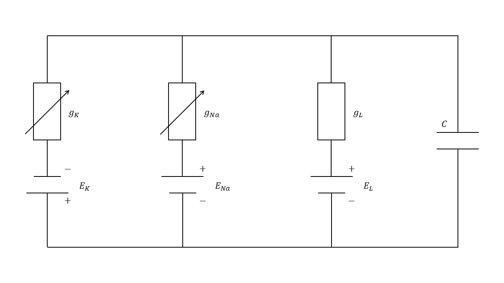
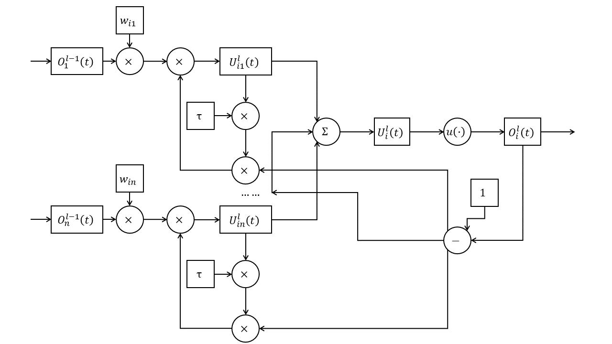

# SNN知识体系

## 1 SNN的编码方式

### 1.1 速率编码

速率编码设想神经元的放电（即脉冲）频率隐含信息，因此以脉冲放电频率作为编码的基础。脉冲放电的频率越高，其所代表的值越大。

$$
\begin{matrix}
→ & t \\\\
| & & | & | & | & & & | & 5 \\\\
| & & & | & & & & & 2 \\\\
| & | & | & | & | & | & | & | & 8 \\\\
| & & & | & | & & | & & 4
\end{matrix}
$$

速率编码可用python模拟如下所示：

```python
import torch
import random

def rate_coding(values, precision: int = 20):
    while True:
        yield torch.tensor([(v >= random.randint(0, precision)) + 0.0 for v in values])

values = [5, 2, 8, 4]
prec = 40
rc = rate_coding(values, prec)

sum = torch.zeros(len(values))

for i in range(prec):
    spikes = next(rc)
    print(spikes)
    sum += spikes

print(sum)
```

速率编码的优势在于：

1. 鲁棒性更强：速率编码不受脉冲时序的影响，因此对于输入信号的微小变化更加鲁棒。在时间编码中，输入信号的微小变化可能会导致脉冲时序的变化，从而影响神经元的激活。

2. 更高的信息传输速率：由于速率编码使用脉冲的频率来表示输入信号的大小，因此可以使用更高的频率来传输更多的信息。相比之下，时间编码的信息传输速率较低，因为每个脉冲都需要一定的时间来传输。

3. 更容易实现：速率编码只需要统计一段时间内脉冲的数量，因此更容易实现。相比之下，时间编码需要准确地测量脉冲的时间，这可能需要更高的精度和计算能力。

然而，其也存在劣势：

1. 时间/空间开销较大：在速率编码中，每个神经元需要记录一定时间内脉冲的数量，因此需要较大的存储空间和计算成本，信息也只能在时间窗口的末尾才能表现出来。相比之下，时间编码中只需要记录每个脉冲的相对时间，且由于首个脉冲携带信息的可能性更大，因此空间开销较小。

2. 精度有限：速率编码的精度受到采样时间的限制，采样时间越短，精度越高，但同时也会增加计算复杂度和存储需求。相比之下，时间编码可以获得更高的精度，因为它可以记录每个脉冲的确切时间。

3. 不易处理异步事件：在速率编码中，每个神经元的脉冲频率是连续的，因此难以处理异步事件。相比之下，时间编码可以处理不同神经元之间的异步事件，因为每个脉冲的相对时间是离散的。

### 1.2 时间编码

时间编码设想脉冲间精确的放电时间隐含信息，因此以脉冲之间放电的精确时间作为编码的基础。一般是以最早到达神经元的脉冲作为基准，相对放电时间越晚，所代表的值越大。

$$
\begin{matrix}
→ & t \\\\
 & & | & | & | & & & | & 2 \\\\
| & & & | & & & & & 0 \\\\
 & | & | & | & | & | & | & | & 1 \\\\
 & & & & & | & | & & 5
\end{matrix}
$$

时间编码可用python模拟如下所示：

```python
import torch
import random

def temporal_coding(values):
    t = 0
    while True:
        yield torch.tensor([min(1, (v == t) + min((v <= t), random.randint(0, 1))) + 0.0 for v in values])
        t += 1

values = [2, 0, 1, 5]
time_steps = 40
rc = temporal_coding(values)

for i in range(time_steps):
    spikes = next(rc)
    print(spikes)
```

时间编码的优势在于：

1. 更高的精度：时间编码可以记录每个脉冲的精确时间，因此相比于速率编码，时间编码可以获得更高的精度。

2. 更高的信息容量：时间编码可以通过微小的时间差来编码不同的输入信号，因此可以获得更高的信息容量。这对于需要处理大量输入信号的任务非常有用。

3. 更适用于异步事件：采用时间编码时，不同神经元之间的事件不需要同步。这对于需要处理异步事件的任务非常有用。

然而，时间编码的劣势也很明显：

1. 鲁棒性不足：时间编码中时间所代表的值取决于每个脉冲与最早产生的脉冲之间的相对时间差，当最早产生的脉冲易主时，整个脉冲所包含的时间会随之变化。

## 2 SNN神经元的类型

### 2.1 霍奇金-赫胥黎神经元模型（HH模型）

HH模型将细胞膜看作一个具有膜电容$C_{M}$和泄露电导$G_{M}$的模型，由于细胞膜内外离子浓度的不同，细胞膜会维持在一个静息电位$V_{rest}$。离子$K^{+}$和$Na^{+}$的流动也会对膜电位产生一定影响。可将其总结为如下公式：

$$I_{m}=C_{m}\frac{dV_{m}}{dt}+I_{Na}+I_{K}+I_{l}$$

其中泄露电流的计算公式可以总结如下

$$I_{l}=g_{l}(V-E_{L})$$

钠离子电流的计算公式可以总结如下

$$I_{Na}=g_{Na}(V-E_{Na})$$

钾离子电流的计算公式可以总结如下

$$I_{K}=g_{K}(V-E_{K})$$

整个模型如下图所示：


霍奇金-赫胥黎模型可以使用python模拟如下所示：

```python
import torch

class HH(nn.Module):
    def __init__(self):
        super(HH, self).__init__()
        self.
```

### 2.2 LIF模型

由HH模型我们得知，注入细胞的电流满足如下公式：

$$I=C\frac{dV}{dt}+g_{Na}(V-E_{Na})+g_{K}(V-E_{K})+g_{L}(V-E_{L})$$

将电流整合在一起，可以得到：

$$I=g(V-E)+C\frac{dV}{dt}$$

其中

$$g=g_{Na}+g_{K}+g_{L},E=\frac{E_{Na}+E_{K}+E_{L}}{g_{Na}+g_{K}+g_{L}}$$

设初值$t=t_{0},V=V_{0}$，解微分方程可得

$$V=(V_{0}-E-\frac{I}{g})e^{-\frac{t-t_{0}}{τ}}+E+\frac{I}{g}$$

其中$τ=\frac{C}{g}$为时间常数，约等于$10ms$。

上式表明，在持续稳定的电流作用下，神经元的电位会逐渐达到顶峰；当受到短暂的电流刺激后，神经元的电位有时来不及达到顶峰便直接开始衰减。此时膜电位的值就和输入脉冲的个数、频率等有关。加入微小时间分量$Δt$，当自然衰减时，可以得到

$$V(t)=\frac{I}{g}[1-(1-\frac{Δt}{τ})]e^{-\frac{t-t_{0}-Δt}{τ}}+E=\frac{I}{g}\frac{Δt}{τ}e^{-\frac{t-t_{0}}{τ}}+E$$

又由$q=IΔt$，$C=gτ$得

$$V(t)=\frac{q}{C}e^{-\frac{t-t_{0}}{τ}}+E$$

这便是LIF模型的生物学原理：在受到刺激时，神经元胞体内会产生反应，造成胞体电位的上升；胞体电位会随时间而衰减，会随新脉冲的到来而增加；当电位越过阈值时，神经元电位重置，并产生一段时间的不应期（期间不产生任何脉冲）。

整个LIF模型使用数学公式描述如下：

（1）神经元胞体电位，由突触传来的脉冲、偏置电位与历史电位相加而成；

$$U_{i}^{l}(t)=\sum_{j}{W_{ij}O_{j}^{l-1}(t)}+b_{i}+H_{i}^{l}(t)$$

（2）神经元是否产生脉冲，由电位与阈值经过Heaviside阶跃函数$u(·)$得出；

$$O_{i}^{l}(t)=u[U_{i}^{l}(t)-u_{th}]$$

（3）神经元历史电位，由当前电位与是否产生脉冲得出。

$$H_{i}^{l}(t)=τU_{i}^{l}(t)[1-O_{i}^{l}(t)]$$



整个模型可用python模拟如下：

```python
import torch

class Heaviside(torch.autograd.Function): 
    @staticmethod
    def forward(ctx, i):
        ctx.save_for_backward(i)
        return i.gt(0).float()

    @staticmethod
    def backward(ctx, g_o):
        i = ctx.saved_tensors
        g_i = g_o.clone() 
        temp = abs(i) < 0.5
        return g_i * temp.float(), None

class LIF(torch.nn.Module):
    def __init__(self, input_shape: int, output_shape: int, max_weight: float, bias: float, threshold: float, tau: float, weights: torch.tensor = None):
        super().__init__()
        self.input_shape = input_shape
        self.output_shape = output_shape
        self.max_weight = max_weight
        self.bias = bias
        self.threshold = threshold
        self.tau = tau
        if weights is None:
            self.weights = torch.rand(self.output_shape, self.input_shape) * max_weight
        else:
            self.weights = weights
        self.history = torch.zeros(self.output_shape)

    def forward(self, x):
        x = x.view(self.input_shape, 1)
        x = self.weights @ x
        x = x.view(self.output_shape)
        x = x + self.bias + self.history
        o = Heaviside.apply(x - self.threshold)
        self.history = (x * self.tau) * (1 - o)
        return o

if __name__ == "__main__":
    values = [5, 2, 8, 4, 0, 3]
    prec = 40
    rc = rate_coding(values, prec)
    lif = LIF(6, 4, 8, 0, 12, 0.5)
    
    for i in range(prec):
        input_spikes = next(rc)
        output_spikes = lif(input_spikes)
        print(output_spikes)
```

### 2.3 SRM0模型

LIF模型的电位在神经元的胞体中累积并计算脉冲，而SRM0模型的电位在各个突触中累积并计算脉冲。在SRM0模型中，来自前一个神经元的脉冲在突触处累积电位，在胞体中加和并计算脉冲。

整个SRM0模型使用公式描述如下：

（1）各个突触内的电压，由上一层的脉冲与该突触的历史相加而成；

$$U_{ij}^{l}(t)=w_{ij}O_{j}^{l-1}(t)+H_{ij}^{l}(t-1)$$

（2）胞体的电位由各个突触的电位累积而成；

$$U_{i}^{l}(t)=\sum_{j}{U_{ij}^{l}(t)}·[1-O_{i}^{l}(t)]$$

（3）神经元是否产生脉冲，由电位与阈值经过Heaviside阶跃函数$u(·)$得出；

$$O_{i}^{l}(t)=u[U_{i}^{l}(t)-u_{th}]$$

（4）各个突触内的历史由突触电位与胞体是否发射脉冲共同作用而成。

$$H_{ij}^{l}(t-1)=τU_{ij}^{l}(t)[1-O_{i}^{l}(t)]$$



整个模型可用python模拟如下：

```python
import torch

class Heaviside(torch.autograd.Function): 
    @staticmethod
    def forward(ctx, i):
        ctx.save_for_backward(i)
        return i.gt(0).float()

    @staticmethod
    def backward(ctx, g_o):
        i = ctx.saved_tensors
        g_i = g_o.clone() 
        temp = abs(i) < 0.5
        return g_i * temp.float(), None

class SRM0(torch.nn.Module):
    def __init__(self, input_shape: int, output_shape: int, max_weight: float, threshold: float, tau: float, weights: torch.tensor = None):
        super().__init__()
        self.input_shape = input_shape
        self.output_shape = output_shape
        self.max_weight = max_weight
        self.threshold = threshold
        self.sigma = torch.ones(self.input_shape, 1)
        self.tau = tau
        if weights is None:
            self.weights = torch.rand(self.output_shape, self.input_shape) * max_weight
        else:
            self.weights = weights
        self.history = torch.zeros(self.output_shape, self.input_shape)

    def forward(self, x):
        x = self.weights * x + self.history * self.tau
        u = x @ self.sigma
        u = u.view(self.output_shape)
        o = Heaviside.apply(u - self.threshold)
        self.history = (x * self.tau) * (1 - torch.repeat_interleave(o.view(self.output_shape, 1), self.input_shape, dim = 1))
        return o

if __name__ == "__main__":
    values = [5, 2, 8, 4, 0, 3]
    prec = 40
    rc = rate_coding(values, prec)
    srm0 = SRM0(6, 4, 8, 10, 0.5)
    
    for i in range(prec):
        input_spikes = next(rc)
        output_spikes = srm0(input_spikes)
        print(output_spikes)
```

## 3 SNN的学习方式

### 3.1 无监督学习

#### 3.1.1 STDP

### 3.2 间接监督学习

#### 3.2.1 ANN转SNN

### 3.3 直接监督学习

#### 3.3.1 STBP

#### 3.3.2 BPTT

## 4 SNN的硬件部署

### 4.1 SNN以IIR的形式部署

### 4.2 时空代数与时空计算网络

## 参考文献