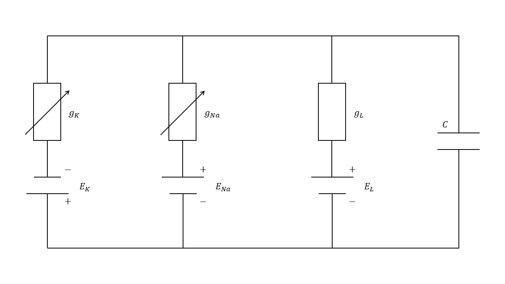
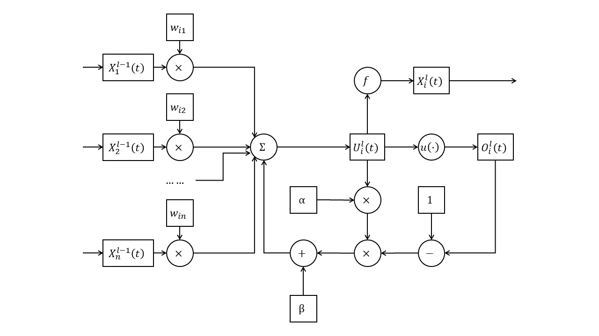

# 脉冲神经网络知识体系

## 1 脉冲神经网络的编码方式

不同于ANN的是，脉冲神经网络（SNN）中的值以脉冲的形式传递。将数值转为脉冲的过程被称作编码（encoding）。在脉冲神经网络中，根据信息编码为脉冲时所利用到的属性的不同，可以将编码方式分为以下几种：

### 1.1 速率编码

速率编码设想神经元的放电（即脉冲）频率隐含信息，因此以脉冲放电频率作为编码的基础。脉冲放电的频率越高，其所代表的值越大。$^{[1][2]}$

$$
\begin{matrix}
→ & t \\\\
| & & | & | & | & & & | & 5 \\\\
| & & & | & & & & & 2 \\\\
| & | & | & | & | & | & | & | & 8 \\\\
| & & & | & | & & | & & 4
\end{matrix}
$$

速率编码可用python模拟如下所示：

```python
import torch
import random

def rate_coding(values, precision: int = 20):
    while True:
        yield torch.tensor([(v >= random.randint(0, precision)) + 0.0 for v in values])

values = [5, 2, 8, 4]
prec = 40
rc = rate_coding(values, prec)

sum = torch.zeros(len(values))

for i in range(prec):
    spikes = next(rc)
    print(spikes)
    sum += spikes

print(sum)
```

速率编码的优势在于：

1. 鲁棒性更强：速率编码不受脉冲时序的影响，因此对于输入信号的微小变化更加鲁棒。在时间编码中，输入信号的微小变化可能会导致脉冲时序的变化，从而影响神经元的激活。

2. 更高的信息传输速率：由于速率编码使用脉冲的频率来表示输入信号的大小，因此可以使用更高的频率来传输更多的信息。相比之下，时间编码的信息传输速率较低，因为每个脉冲都需要一定的时间来传输。

3. 更容易实现：速率编码只需要统计一段时间内脉冲的数量，因此更容易实现。相比之下，时间编码需要准确地测量脉冲的时间，这可能需要更高的精度和计算能力。

然而，其也存在劣势：

1. 时间/空间开销较大：在速率编码中，每个神经元需要记录一定时间内脉冲的数量，因此需要较大的存储空间和计算成本，信息也只能在时间窗口的末尾才能表现出来。相比之下，时间编码中只需要记录每个脉冲的相对时间，且由于首个脉冲携带信息的可能性更大，因此空间开销较小。

2. 精度有限：速率编码的精度受到采样时间的限制，采样时间越短，精度越高，但同时也会增加计算复杂度和存储需求。相比之下，时间编码可以获得更高的精度，因为它可以记录每个脉冲的确切时间。

3. 不易处理异步事件：在速率编码中，每个神经元的脉冲频率是连续的，因此难以处理异步事件。相比之下，时间编码可以处理不同神经元之间的异步事件，因为每个脉冲的相对时间是离散的。

### 1.2 时间编码

时间编码设想脉冲间精确的放电时间隐含信息，因此以脉冲之间放电的精确时间作为编码的基础。一般是以最早到达神经元的脉冲作为基准，相对放电时间越晚，所代表的值越大。$^{[1][3]}$

$$
\begin{matrix}
→ & t \\\\
 & & | & | & | & & & | & 2 \\\\
| & & & | & & & & & 0 \\\\
 & | & | & | & | & | & | & | & 1 \\\\
 & & & & & | & | & & 5
\end{matrix}
$$

时间编码可用python模拟如下所示：

```python
import torch
import random

def temporal_coding(values):
    t = 0
    while True:
        yield torch.tensor([min(1, (v == t) + min((v <= t), random.randint(0, 1))) + 0.0 for v in values])
        t += 1

values = [2, 0, 1, 5]
time_steps = 40
rc = temporal_coding(values)

for i in range(time_steps):
    spikes = next(rc)
    print(spikes)
```

时间编码的优势在于：

1. 更高的精度：时间编码可以记录每个脉冲的精确时间，因此相比于速率编码，时间编码可以获得更高的精度。

2. 更高的信息容量：时间编码可以通过微小的时间差来编码不同的输入信号，因此可以获得更高的信息容量。这对于需要处理大量输入信号的任务非常有用。

3. 更适用于异步事件：采用时间编码时，不同神经元之间的事件不需要同步。这对于需要处理异步事件的任务非常有用。

然而，时间编码的劣势也很明显：

1. 鲁棒性不足：时间编码中时间所代表的值取决于每个脉冲与最早产生的脉冲之间的相对时间差，当最早产生的脉冲易主时，整个脉冲所包含的时间会随之变化。

## 2 脉冲神经网络神经元的类型

与ANN相似的是，脉冲神经网络的组成也是由神经元组成层，再由层组成整个脉冲神经网络计算网络。脉冲神经网络中神经元的选择也尤为关键。神经元的目的是处理输入的脉冲，并且由输入的脉冲产生对应输出的脉冲。根据内部运算方式的不同，神经元模型可以被分为如下几种。其中由于脉冲神经网络中神经元的生物学原理相似，每种神经元之间都能找到相对应的共有的结构或模式，但每种神经元彼此之间又不尽相同：

### 2.1 霍奇金-赫胥黎神经元模型（HH模型）

HH模型将细胞膜看作一个具有膜电容$C_{M}$和泄露电导$G_{M}$的模型，由于细胞膜内外离子浓度的不同，细胞膜会维持在一个静息电位$V_{rest}$。离子$K^{+}$和$Na^{+}$的流动也会对膜电位产生一定影响。可将其总结为如下公式：$^{[4]}$

$$I_{m}=C_{m}\frac{dV_{m}}{dt}+I_{Na}+I_{K}+I_{l}$$

其中泄露电流的计算公式可以总结如下

$$I_{l}=g_{l}(V-E_{L})$$

钠离子电流的计算公式可以总结如下

$$I_{Na}=g_{Na}(V-E_{Na})$$

钾离子电流的计算公式可以总结如下

$$I_{K}=g_{K}(V-E_{K})$$

整个模型如下图所示：


### 2.2 LIF模型

由HH模型我们得知，注入细胞的电流满足如下公式：

$$I=C\frac{dV}{dt}+g_{Na}(V-E_{Na})+g_{K}(V-E_{K})+g_{L}(V-E_{L})$$

将电流整合在一起，可以得到：

$$I=g(V-E)+C\frac{dV}{dt}$$

其中

$$g=g_{Na}+g_{K}+g_{L},E=\frac{E_{Na}+E_{K}+E_{L}}{g_{Na}+g_{K}+g_{L}}$$

设初值$t=t_{0},V=V_{0}$，解微分方程可得

$$V=(V_{0}-E-\frac{I}{g})e^{-\frac{t-t_{0}}{τ}}+E+\frac{I}{g}$$

其中$τ=\frac{C}{g}$为时间常数，约等于$10ms$。

上式表明，在持续稳定的电流作用下，神经元的电位会逐渐达到顶峰；当受到短暂的电流刺激后，神经元的电位有时来不及达到顶峰便直接开始衰减。此时膜电位的值就和输入脉冲的个数、频率等有关。加入微小时间分量$Δt$，当自然衰减时，可以得到

$$V(t)=\frac{I}{g}[1-(1-\frac{Δt}{τ})]e^{-\frac{t-t_{0}-Δt}{τ}}+E=\frac{I}{g}\frac{Δt}{τ}e^{-\frac{t-t_{0}}{τ}}+E$$

又由$q=IΔt$，$C=gτ$得

$$V(t)=\frac{q}{C}e^{-\frac{t-t_{0}}{τ}}+E$$

这便是LIF模型的生物学原理：在受到刺激时，神经元胞体内会产生反应，造成胞体电位的上升；胞体电位会随时间而衰减，会随新脉冲的到来而增加；当电位越过阈值时，神经元电位重置，并产生一段时间的不应期（期间不产生任何脉冲）。

整个LIF模型使用数学公式描述如下：$^{[5]}$

（1）神经元胞体电位，由突触传来的脉冲、偏置电位与历史电位相加而成，

$$U_{i}^{l}(t)=\sum_{j}{w_{ij}O_{j}^{l-1}(t)}+b_{i}+H_{i}^{l}(t)$$

其中$w_{ij}$为权重，$b_{i}$为偏置；

（2）神经元是否产生脉冲，由电位与阈值经过Heaviside阶跃函数$u(·)$得出，

$$O_{i}^{l}(t)=u[U_{i}^{l}(t)-u_{th}]$$

其中$u_{th}$为阈电位；

（3）神经元历史电位，由当前电位与是否产生脉冲得出，

$$H_{i}^{l}(t)=τU_{i}^{l}(t-1)[1-O_{i}^{l}(t-1)]$$

其中$τ$为时间常数。


整个模型可用python模拟如下：

```python
import torch

class Heaviside(torch.autograd.Function): 
    @staticmethod
    def forward(ctx, i):
        ctx.save_for_backward(i)
        return i.gt(0).float()

    @staticmethod
    def backward(ctx, g_o):
        i = ctx.saved_tensors
        g_i = g_o.clone() 
        temp = abs(i) < 0.5
        return g_i * temp.float(), None

class LIF(torch.nn.Module):
    def __init__(self, input_shape: int, output_shape: int, max_weight: float, bias: float, threshold: float, tau: float, weights: torch.tensor = None):
        super().__init__()
        self.input_shape = input_shape
        self.output_shape = output_shape
        self.max_weight = max_weight
        self.bias = bias
        self.threshold = threshold
        self.tau = tau
        if weights is None:
            self.weights = torch.rand(self.output_shape, self.input_shape) * max_weight
        else:
            self.weights = weights
        self.history = torch.zeros(self.output_shape)

    def forward(self, x):
        x = x.view(self.input_shape, 1)
        x = self.weights @ x
        x = x.view(self.output_shape)
        x = x + self.bias + self.history
        o = Heaviside.apply(x - self.threshold)
        self.history = (x * self.tau) * (1 - o)
        return o

if __name__ == "__main__":
    values = [5, 2, 8, 4, 0, 3]
    prec = 40
    rc = rate_coding(values, prec)
    lif = LIF(6, 4, 8, 0, 12, 0.5)
    
    for i in range(prec):
        input_spikes = next(rc)
        output_spikes = lif(input_spikes)
        print(output_spikes)
```

### 2.3 SRM0模型

LIF模型的电位在神经元的胞体中累积并计算脉冲，而SRM0模型的电位在各个突触中累积并计算脉冲。在SRM0模型中，来自前一个神经元的脉冲在突触处累积电位，在胞体中加和并计算脉冲。

整个SRM0模型使用公式描述如下：$^{[6]}$

（1）各个突触内的电位，由上一层的脉冲与该突触的历史相加而成；

$$U_{ij}^{l}(t)=w_{ij}O_{j}^{l-1}(t)+H_{ij}^{l}(t)$$

其中$w_{ij}$为权重；

（2）胞体的电位由各个突触的电位累积而成；

$$U_{i}^{l}(t)=\sum_{j}{U_{ij}^{l}(t)}·[1-O_{i}^{l}(t)]$$

（3）神经元是否产生脉冲，由电位与阈值经过Heaviside阶跃函数$u(·)$得出，

$$O_{i}^{l}(t)=u[U_{i}^{l}(t)-u_{th}]$$

其中$u_{th}$为阈电位；

（4）各个突触内的历史由突触电位与胞体是否发射脉冲共同作用而成，

$$H_{ij}^{l}(t)=τU_{ij}^{l}(t-1)[1-O_{i}^{l}(t-1)]$$

其中$τ$为时间常数。



整个模型可用python模拟如下：

```python
import torch

class Heaviside(torch.autograd.Function): 
    @staticmethod
    def forward(ctx, i):
        ctx.save_for_backward(i)
        return i.gt(0).float()

    @staticmethod
    def backward(ctx, g_o):
        i = ctx.saved_tensors
        g_i = g_o.clone() 
        temp = abs(i) < 0.5
        return g_i * temp.float(), None

class SRM0(torch.nn.Module):
    def __init__(self, input_shape: int, output_shape: int, max_weight: float, threshold: float, tau: float, weights: torch.tensor = None):
        super().__init__()
        self.input_shape = input_shape
        self.output_shape = output_shape
        self.max_weight = max_weight
        self.threshold = threshold
        self.sigma = torch.ones(self.input_shape, 1)
        self.tau = tau
        if weights is None:
            self.weights = torch.rand(self.output_shape, self.input_shape) * max_weight
        else:
            self.weights = weights
        self.history = torch.zeros(self.output_shape, self.input_shape)

    def forward(self, x):
        x = self.weights * x + self.history * self.tau
        u = x @ self.sigma
        u = u.view(self.output_shape)
        o = Heaviside.apply(u - self.threshold)
        self.history = (x * self.tau) * (1 - torch.repeat_interleave(o.view(self.output_shape, 1), self.input_shape, dim = 1))
        return o

if __name__ == "__main__":
    values = [5, 2, 8, 4, 0, 3]
    prec = 40
    rc = rate_coding(values, prec)
    srm0 = SRM0(6, 4, 8, 10, 0.5)
    
    for i in range(prec):
        input_spikes = next(rc)
        output_spikes = srm0(input_spikes)
        print(output_spikes)
```

### 2.4 LIAF模型

LIF模型的输入与输出均为脉冲，其在神经元中经历了电压积累与脉冲计算的过程；而LIAF模型的输入与输出均为模拟电位值，其神经元内部和LIF神经元类似，但输出的值为模拟电位$U_{i}^{l}(t)$。

整个LIAF模型使用公式描述如下：$^{[7]}$

（1）神经元胞体电位，由突触传来的电位与历史电位相加而成；

$$U_{i}^{l}(t)=\sum_{j}{w_{ij}X_{j}^{l-1}(t)}+H_{i}^{l}(t)$$

其中$w_{ij}$为权重；

（2）神经元是否产生脉冲，由电位与阈值经过Heaviside阶跃函数$u(·)$得出，但不以脉冲作为输出，脉冲仅用于计算历史电位，

$$O_{i}^{l}(t)=u[U_{i}^{l}(t)-u_{th}]$$

其中$u_{th}$为阈电位；

（3）神经元历史电位，由当前电位与是否产生脉冲得出，

$$H_{i}^{l}(t)=α[u_{reset}O_{i}^{l}(t-1)+U_{i}^{l}(t-1)[1-O_{i}^{l}(t-1)]]+β$$

其中$α$，$β$为参数，$u_{reset}$为重置电位；

（4）神经元的输出取决于神经元当前的电位，

$$X_{i}^{l}(t)=f[U_{i}^{l}(t),u_{th}]$$

其中$f(·)$为动作函数（但不能是阶跃函数$u(·)$，否则会降级为LIF）。



整个模型可用python模拟如下：

```python
import torch

class Heaviside(torch.autograd.Function): 
    @staticmethod
    def forward(ctx, i):
        """
        阶跃函数前向传播公式
        """
        ctx.save_for_backward(i)
        return i.gt(0).float()

    @staticmethod
    def backward(ctx, g_o):
        """
        阶跃函数反向传播公式
        """
        i = ctx.saved_tensors
        g_i = g_o.clone() 
        temp = abs(i) < 0.5
        return g_i * temp.float(), None

class LIAF(torch.nn.Module):
    def __init__(self, input_shape: int, output_shape: int, max_weight: float, threshold: float, alpha: float, beta: float, act_fun: torch.nn.Module = torch.nn.ReLU(), weights: torch.tensor = None):
        super().__init__()
        self.input_shape = input_shape
        self.output_shape = output_shape
        self.max_weight = max_weight
        self.threshold = threshold
        self.alpha = alpha
        self.beta = beta
        self.act_fun = act_fun
        if weights is None:
            self.weights = torch.rand(self.output_shape, self.input_shape) * max_weight
        else:
            self.weights = weights
        self.history = torch.zeros(self.output_shape)

    def forward(self, x):
        x = x.view(self.input_shape, 1)
        x = self.weights @ x
        x = x.view(self.output_shape)
        x = x + self.history
        o = Heaviside.apply(x - self.threshold)
        self.history = self.alpha * (x * (1 - o)) + self.beta
        x = self.act_fun(x - self.threshold)
        return x

if __name__ == "__main__":
    values = [5, 2, 8, 4, 0, 3]
    prec = 40
    rc = rate_coding(values, prec)
    liaf = LIAF(6, 4, 8, 12, 0.5, 0.5)
    
    for i in range(prec):
        input_spikes = next(rc)
        output_spikes = liaf(input_spikes)
        print(output_spikes)
```

## 3 脉冲神经网络的学习方式

脉冲神经网络的参数要经过训练，才能完美地完成我们所给予的任务。脉冲神经网络的训练方式多种多样。此处采取Wu等人（2018）的分类方式，将脉冲神经网络的训练分为如下三类：

### 3.1 无监督学习

无监督学习旨在通过观察每个神经元自己的输入与输出来自动调整每个神经元的权重，以对不同的输入模式做不同的响应。在这之中，最典型的无监督学习方式就是STDP。

#### 3.1.1 脉冲时序依赖可塑性

脉冲时序依赖可塑性（Spike-timing Dependent Plasticity, STDP）可以用来训练脉冲神经网络的神经元。作为一个时许非对称形式的Hebb学习法则，其依赖突触前和突触后神经元脉冲之间的紧密时间相关性来进行训练。$^{[8],[9]}$

假设编号为$i$的神经元第$j$个突触的输入脉冲序列为$\vec{t}_{j}=\{t|O_{j}^{l-1}(t)=1\}$，输出脉冲序列为$\vec{t}_{i}=\{t|O_{i}^{l}(t)=1\}$，则对于该神经元的第$j$个突触，其权重变化值为

$$Δw_{ij}=\sum_{t_{j}∈\vec{t}_{j}}{\sum_{t_{i}∈\vec{t}_{i}}W(t_{i}-t_{j})}$$

其中STDP函数$W(x)$一般定义如下：

$$
W(x)=\left\{
\begin{aligned}
A_{+}e^{-\frac{x}{τ_{+}}},x>0 \\\\
0,x=0 \\\\
-A_{-}e^{\frac{x}{τ_{-}}},x<0
\end{aligned}
\right.
$$

其中$A_{+}$、$A_{-}$、$τ_{+}$、$τ_{-}$均为需设定的参数。

STDP可以用python模拟如下：

```python
import math
import torch

def STDP(input_shape: int, output_shape: int, time_steps: int, input_spike_train: torch.tensor, output_spike_train: torch.tensor, weight_matrix: torch.tensor, max_weight: float, a_pos: float, a_neg: float, tau_pos: float, tau_neg: float):
    """
    通过STDP更新权重
    @params:
        input_shape: int 输入长度j（该层每个神经元突触长度）
        output_shape: int 输出长度i（该层神经元长度）
        time_steps: int 总时间步长t
        input_spike_train: torch.tensor 输入脉冲序列，一个形状为j×t的矩阵，每个元素0代表无脉冲，1代表有脉冲
        output_spike_train: torch.tensor 输出脉冲序列，一个形状为i×t的矩阵，每个元素0代表无脉冲，1代表有脉冲
        weight_matrix: torch.tensor 权重矩阵，一个形状为i×j的矩阵
        max_weight: float 最大权重
        a_pos: 参数A+
        a_neg: 参数A-
        tau_pos: 参数τ+
        tau_neg: 参数τ-
    @return:
        torch.tensor 更新后的权重矩阵
    """
    for i in range(output_shape):
        for j in range(input_shape):
            delta_w = 0.0
            for tj in range(time_steps):
                if input_spike_train[j, tj]:
                    for ti in range(time_steps):
                        if output_spike_train[i, ti]:
                            delta_t = ti - tj
                            if delta_t == 0:
                                delta_w += 0
                            elif delta_t > 0:
                                delta_w += a_pos * math.exp(-delta_t / tau_pos)
                            elif delta_t < 0:
                                delta_w += -a_neg * math.exp(delta_t / tau_neg)
            weight_matrix[i, j] += delta_w
    return weight_matrix
```

### 3.2 间接监督学习

间接监督学习并非直接训练脉冲神经网络，而是通过其它方式训练网络，再将训练好的网络或参数置入脉冲神经网络之中。其中最典型的方法即为ANN转SNN。

#### 3.2.1 ANN转SNN


### 3.3 直接监督学习

#### 3.3.1 时间-空间反向传播

时间-空间反向传播（Spatio-Temporal Backpropagation, STBP）利用LIF神经元中关于电位、脉冲之间的内在关系，将传统的反向传播应用在基于时间-空间结构的脉冲神经网络中。

回顾描述LIF神经元的数学公式：

$$U_{i}^{l}(t)=\sum_{j}{w_{ij}O_{j}^{l-1}(t)}+b_{i}+H_{i}^{l}(t)$$

$$O_{i}^{l}(t)=u[U_{i}^{l}(t)-u_{th}]$$

$$H_{i}^{l}(t)=τU_{i}^{l}(t-1)[1-O_{i}^{l}(t-1)]$$

根据链式求导法则，可以推得：

$$\frac{\partial U_{i}^{l}(t)}{\partial O_{j}^{l-1}(t)}=w_{ij}$$

$$\frac{\partial O_{i}^{l}(t)}{\partial U_{i}^{l}(t)}=\frac{\partial u}{\partial U_{i}^{l}(t)}$$

$$\frac{\partial U_{i}^{l}(t)}{\partial U_{i}^{l}(t-1)}=τ[1-O_{i}^{l}(t-1)]$$

$$\frac{\partial O_{i}^{l}(t)}{\partial O_{i}^{l}(t-1)}=\frac{\partial O_{i}^{l}(t)}{\partial U_{i}^{l}(t)}\frac{\partial U_{i}^{l}(t)}{\partial O_{i}^{l}(t-1)}=-τU_{i}^{l}(t-1)\frac{\partial u}{\partial U_{i}^{l}(t)}$$

设损失为均方差损失：

$$L=\frac{1}{2S}\sum_{s=1}^{S}{||y_{s}-\frac{1}{T}\sum_{t=1}^{T}{O_{s}^{N}(t)}||}_{2}^{2}$$

则：

（1）对于最后一层$l=N$，其只需要考虑在时间维度的求导：

对于最后一个时间刻$t=T$：

$$δ_{i}^{N}(T)=\frac{\partial L}{\partial O_{i}^{N}(T)}=-\frac{1}{TS}[y_{i}-\frac{1}{T}\sum_{t=1}^{T}{O_{i}^{N}(t)}]$$

$$\frac{\partial L}{\partial U_{i}^{N}(T)}=δ_{i}^{N}(T)\frac{\partial O_{i}^{N}(T)}{\partial U_{i}^{N}(T)}=δ_{i}^{N}(T)\frac{\partial u}{\partial U_{i}^{N}(T)}$$

对于前面的时间刻$t<T$：

$$δ_{i}^{N}(t)=\frac{\partial L}{\partial O_{i}^{N}(t)}=\frac{\partial L}{\partial O_{i}^{N}(t+1)}\frac{\partial O_{i}^{N}(t+1)}{\partial O_{i}^{N}(t)}+δ_{i}^{N}(T)=-τU_{i}^{N}(t)δ_{i}^{N}(t+1)\frac{\partial u}{\partial U_{i}^{N}(t+1)}+δ_{i}^{N}(T)$$

$$\frac{\partial L}{\partial U_{i}^{N}(t)}=\frac{\partial L}{\partial U_{i}^{N}(t+1)}\frac{\partial U_{i}^{l}(t+1)}{\partial U_{i}^{l}(t)}=δ_{i}^{N}(t+1)τ[1-O_{i}^{N}(t)]\frac{\partial u}{\partial U_{i}^{N}(t+1)}$$

（2）对于前面的层$l<N$，其在考虑时间维度求导的基础上，还要考虑空间维度求导：

对于最后一个时间刻$t=T$：

$$δ_{i}^{l}(T)=\frac{\partial L}{\partial O_{i}^{l}(T)}=\sum_{j}{δ_{j}^{l+1}(T)\frac{\partial O_{j}^{l+1}(T)}{\partial O_{i}^{l}(T)}}=\sum_{j}{δ_{j}^{l+1}(T)\frac{\partial u}{\partial U_{j}^{l+1}(T)}w_{ji}}$$

$$\frac{\partial L}{\partial U_{i}^{l}(T)}=δ_{i}^{l}(T)\frac{\partial O_{i}^{l}(T)}{\partial U_{i}^{l}(T)}=δ_{i}^{l}(T)\frac{\partial u}{\partial U_{i}^{l}(T)}$$

对于前面的时间刻$t<T$：

$$δ_{i}^{l}(t)=\frac{\partial L}{\partial O_{i}^{l}(t)}=\sum_{j}{δ_{j}^{l+1}(t)\frac{\partial O_{j}^{l+1}(t)}{\partial O_{i}^{l}(t)}}+\frac{\partial L}{\partial O_{i}^{l}(t+1)}\frac{\partial O_{i}^{l}(t+1)}{\partial O_{i}^{l}(t)}=\sum_{j}{δ_{j}^{l+1}(t)\frac{\partial u}{\partial U_{j}^{l+1}(t)}w_{ji}}-τU_{i}^{l}(t)δ_{i}^{l}(t+1)\frac{\partial u}{\partial U_{i}^{l}(t+1)}$$

$$\frac{\partial L}{\partial U_{i}^{l}(t)}=δ_{i}^{l}(t)\frac{\partial O_{i}^{l}(t)}{\partial U_{i}^{l}(t)}+δ_{i}^{l}(t+1)\frac{\partial O_{i}^{l}(t+1)}{\partial U_{i}^{l}(t)}=δ_{i}^{l}(t)\frac{\partial u}{\partial U_{i}^{l}(t)}+δ_{i}^{l}(t+1)τ[1-O_{i}^{l}(t)]$$

随后，便可根据$\frac{\partial L}{\partial O_{i}^{l}(t)}$和$\frac{\partial L}{\partial U_{i}^{l}(t)}$计算$\frac{\partial L}{\partial b^{l}}$与$\frac{\partial L}{\partial w^{l}}$：

$$\frac{\partial L}{\partial b_{i}^{l}}=\sum_{t=1}^{T}{\frac{\partial L}{\partial U_{i}^{l}(t)}\frac{\partial U_{i}^{l}(t)}{\partial b_{i}^{l}}}=\sum_{t=1}^{T}{\frac{\partial L}{\partial U_{i}^{l}(t)}}$$

$$\frac{\partial L}{\partial w_{ij}^{l}}=\sum_{t=1}^{T}{\frac{\partial L}{\partial U_{i}^{l}(t)}\frac{\partial U_{i}^{l}(t)}{\partial w_{ij}^{l}}}=\sum_{t=1}^{T}{\frac{\partial L}{\partial U_{i}^{l}(t)}O_{j}^{l-1}(t)}$$

由此便可更新整个脉冲神经网络的参数。由于此算法可借助pytorch中的自动求导实现，因此此处不再给出具体实现方式。可以参考代码仓库[https://github.com/yjwu17/STBP-for-training-SpikingNN](https://github.com/yjwu17/STBP-for-training-SpikingNN)。

#### 3.3.2 BPTT

## 4 脉冲神经网络的硬件部署

### 4.1 脉冲神经网络以IIR的形式部署

### 4.2 时空代数与时空计算网络

## 参考文献

[1] Smith J E. Space-time computing with temporal neural networks[J]. Synthesis Lectures on Computer Architecture, 2017, 12(2): i-215.

[2] Fidjeland A K, Roesch E B, Shanahan M P, et al. NeMo: a platform for neural modelling of spiking neurons using GPUs[C]//2009 20th IEEE international conference on application-specific systems, architectures and processors. IEEE, 2009: 137-144.

[3] Lazar A A. Time encoding with an integrate-and-fire neuron with a refractory period[J]. Neurocomputing, 2004, 58: 53-58.

[4] Hodgkin A L, Huxley A F. A quantitative description of membrane current and its application to conduction and excitation in nerve[J]. The Journal of physiology, 1952, 117(4): 500.

[5] Smith J E. Efficient digital neurons for large scale cortical architectures[J]. ACM SIGARCH Computer Architecture News, 2014, 42(3): 229-240.

[6] Gerstner W, Kistler W M. Spiking neuron models: Single neurons, populations, plasticity[M]. Cambridge university press, 2002.

[7] Wu Z, Zhang H, Lin Y, et al. Liaf-net: Leaky integrate and analog fire network for lightweight and efficient spatiotemporal information processing[J]. IEEE Transactions on Neural Networks and Learning Systems, 2021, 33(11): 6249-6262.

[8]Dan Y, Poo M. Spike timing-dependent plasticity of neural circuits[J]. Neuron, 2004, 44(1): 23-30.

[9]Jesper Sjöström, Wulfram Gerstner. Spike-timing dependent plasticity[J]. Scholarpedia, 5(2):1362.